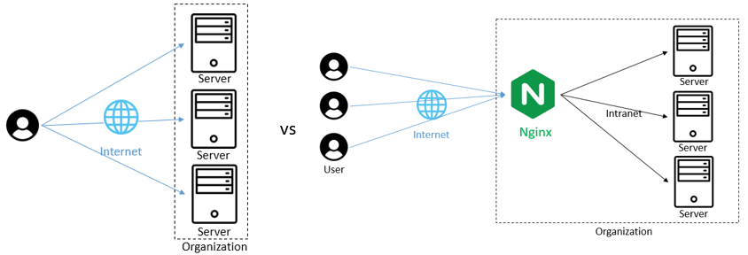
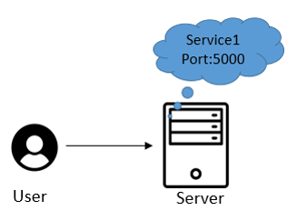
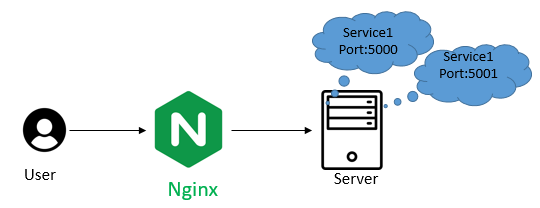
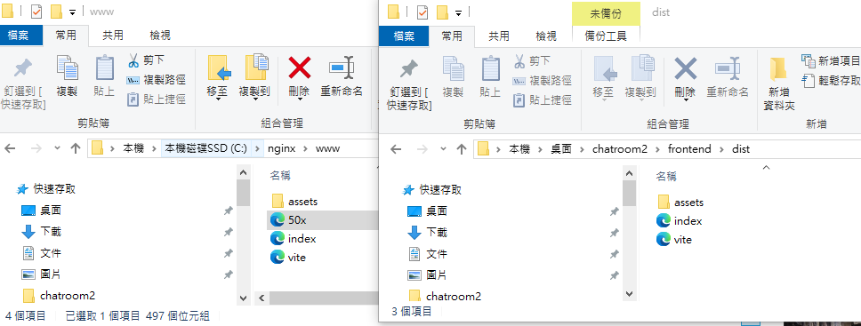
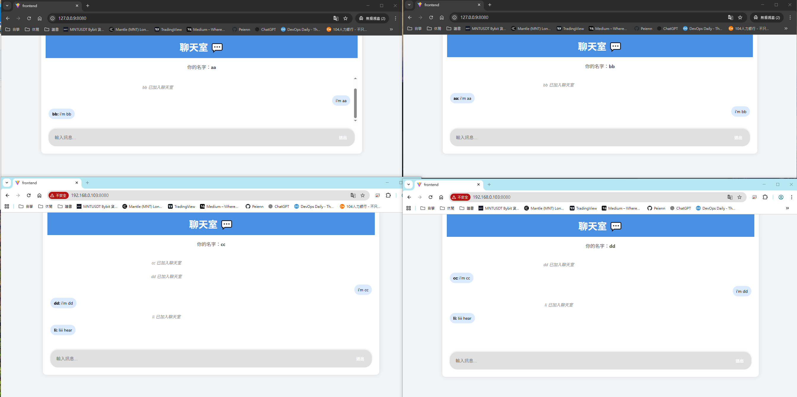
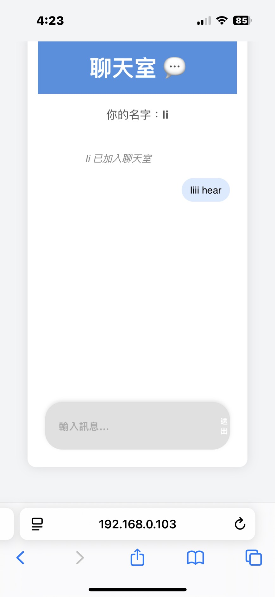

Nginx 是甚麼以及如何用?

# 主要流程 
1. Nginx 介紹
2. Nginx 安裝
3. Nginx 使用
4. Nginx + 實際案例(多人聊天室)


## 1. Nginx 介紹

Nginx 是輕量且高效能的 Web 伺服器（Web Server），負責扮演網站的「接待員」角色。<br>
當使用者訪問你的網站時，Web Server 會接收請求，尋找對應的資源（如網頁、圖片、影片等），再將這些資料傳送回使用者端。




從上圖可以看出發現，沒有Nginx的情況下，由使用者決定要去連到哪一台後端伺服器來獲取資訊，<br>但如果今天採用了Nginx，就會變成是使用者連線到Nginx，由Nginx來決定是哪一台後端伺服器提供資訊。至此可知，後端伺服器會有好幾台且都是相同的服務。

#### Nginx 主要特色:
1. 反向代理（Reverse Proxy） : Nginx 作為使用者與後端伺服器間的中介，負責將請求轉發到指定的後端伺服器。
2. 負載平衡（Load Balancing）: Nginx 可根據設定的策略（如輪詢、IP hash）將流量分配到多台後端伺服器，提高效能與可靠性。
<br>
<br>

#### 衍伸問題:

Q1 : 平常用Flask or React 等等網站開發工具也都有相同功能，這樣有用到Web Server?<br>
A1 : 這些都是**開發用的伺服器**，讓你可以快速啟動和測試而已。真正的Web Server是有「獨立軟體」負責接收並回應 HTTP 請求。ex: GitHub Pages、Nginx、Microsoft IIS。

Q2 : 不用Web Server也可以的話，為甚麼要用?<br>
A2 : 開發環境可以不用，但是生產環境需要用。因為生產環境會遇到各種情況，例如駭客攻擊、大量用戶連線時系統無法負荷等等。Nginx可以透過反向代理去處理安全性問題(隱藏後端伺服器IP或是過濾惡意請求)、透過負載平衡去處理流量問題，提高系統的可用性與穩定性。

Q3 : 為甚麼Web Server可以處理流量問題?<br>
A3 :  沒有Web Server的情況，開發伺服器需要同時處理 "靜態" 和 "動態" 的需求，造成資源競爭與效能瓶頸。
- 靜態: Html, JavaScript, Css, ... etc
- 動態: API, Database, ... etc <br>

加入了Web Server之後
- **靜態資源以及流量分配** 由 Web Server 負責
- **動態資源** 由後端伺服器負責

---

## 2. Nginx 安裝

#### -Linux : 直接進入os
```markdown
# 保持套件是最新版本
sudo apt update
# 安裝 Nginx
sudo apt install nginx
# 啟動 Nginx
sudo systemctl start nginx
# 檢查 Nginx 是否正在執行
sudo systemctl status nginx
# 進入首頁
http://localhost/    --> Welcome to nginx
```
#### -Windows : 下載Nginx軟體包，並放到你想放置的位置 例如 C:\nginx\
```markdown
# 切換路徑
cd c:\nginx
# 開啟nginx
.\nginx.exe
# 進入首頁
http://localhost/    --> Welcome to nginx
```
---


## 3. Nginx 使用

概念就是把 "靜態資源" 都放在剛剛起的Nginx Server上面，直接由Nginx提供。<br>
而動態資源(如API、後端應用)則由 Nginx 作為反向代理，轉發請求給後端伺服器。設定寫在nginx.conf。

---

Nginx 的設定有多種方式可以實現流量處理，常見兩種方法，各有優缺點：

1. 多台 Server 開啟相同服務
2. **單台 Server 開啟相同服務（不同 Port）**  

因為專案需求為簡單實作，所以採用方法二。

|方法|優點|缺點|適用場景|
|--|--|--|--|
|多台 Server 開啟相同服務| - 可用性高，容錯性佳<br>- 容易水平擴展<br>- 可分散大量流量 | - 部署和管理較複雜<br>- 需跨伺服器資料同步和協調 | 大型生產環境<br>高流量需求 |
|單台 Server 多個 Port 實例  | - 部署快速簡單<br>- 節省硬體成本<br>- 適合開發與測試環境 | - 受限於單機資源<br>- 單點故障風險<br>- 不適合高流量場景 | 小型專案<br>開發測試環境  |
---

## 4. 搭配專案的題目 : 多人聊天室 

### 架構調整
原本多人聊天室的架構 : 
- 後端伺服器 * 1
- 服務 * 1 (Port:5000)



加入Nginx後會變成下圖。多一個服務 (Port:5001) 是為了要實現 "流量控制" 的效果。<br>
- <span style="color:green">網頁伺服器 * 1 (Web Server)</span>
- 後端伺服器 * 1
- 服務 * 1 (Port:5000) +  <span style="color:green">服務 * 1 (Port:5001)</span>




--- 
---
### 程式及參數調整
#### steps 1: 修改後端程式碼，以及啟動多人聊天室的後端伺服器

1. 原本只有一個backend，現在多加一個backend2，模擬第二台後端伺服器，但要把backend2的端口改成3001
2. 調整io入口的程式碼，讓系統更安全
```markdown
# 原來版本: origin:允許誰進來你的伺服器，設成 * 代表任何人的網站都可以連線到你的後端伺服器
const io = new Server(server, {
  cors: { origin: '*' } 
});
```
```markdown
# 修改版本 : 指定允許的網域。path跟transports可加可不加(預設也是如此)，寫了更穩定。
const io = new Server(server, {
  cors: { 
    origin: [
      'http://localhost:8080',
      'http://127.0.0.1:8080',
      /^http:\/\/192\.168\.\d{1,3}\.\d{1,3}:8080$/  // 允許所有 192.168.x.x
    ],
    credentials: true
  },
  path: '/socket.io/',
  transports: ['websocket', 'polling']
});

```

3. 修改io入口後，就可以啟用兩台後端伺服器
```markdown
chatroom2\backend>npm run dev
chatroom2\backend2>npm run dev
```

---


#### steps 2: 修改前端的io --> 要連到哪裡去
原本:寫死完整 URL (host + port) const socket = io("http://localhost:3000"); <br>
- 問題 1: 寫死 localhost → 手機無法連，因為 localhost 會指向手機自己的 3000 port,但手機沒有 Backend → Error
- 問題 2: 寫死 3000 → 繞過 Nginx,直達Backend，無法負載均衡

修改後: 使用相對路徑(自動適應當前網址) <br>
const socket = io({
  path: "/socket.io/"
});
- 優點 1: host, port 自動適應 (你網址輸入甚麼就自動帶入)
- 優點 2: 由 Nginx 分配流量到多個後端 (因為你輸入的Port就是Nginx的)


```markdown
# 原本前端連線的端口設定，直通後端伺服器(寫死localhost & port)
const socket = io("http://localhost:3000");
# 修改為 前端連線到 Nginx,由 Nginx 分配流量
const socket = io({
  path: "/socket.io/"
});
```


---

#### steps 3: 修改完後就可以把前端的東西放到Nginx內 (如前述所說，靜態資源由Web Server提供)

```markdown
# React 專案打包成靜態檔案
npm run build
# 打包的東西就會在 fronted/dist/，接著把下面的所有檔案全部丟到C:/nginx/www;
```



#### steps 4: 啟動Nginx (但要先進行conf設定)

- 設定Nginx/conf/nginx.conf

```markdown
    worker_processes  1;
    events {
        worker_connections 1024;
    }

    http {
        include       mime.types;
        default_type  application/octet-stream;

        sendfile        on;
        keepalive_timeout  65;

        # WebSocket 升級判斷
        map $http_upgrade $connection_upgrade {
            default upgrade;
            ''      close;
        }

# 連線到兩個後端伺服器
        # 後端 API (Express)
        upstream api_upstream {
            ip_hash;            #功能:同一個IP只會連到一個伺服器(Stateful Connection)
            server 127.0.0.1:3000;
            server 127.0.0.1:3001;
        }

        server {
            listen 8080;

# C:/nginx/www 就是前端的靜態資源所放的位置
            # ① React build 後的 dist 位置
            root   C:/nginx/www;
            index  index.html;

            # ② React: 處理 SPA 路由 (避免刷新 404)
            location / {
                try_files $uri /index.html;
            }
            # ④ Socket.IO WebSocket 支援（聊天室必要）
            location /socket.io/ {
                proxy_pass http://api_upstream;
                proxy_set_header Host $host;
                proxy_http_version 1.1;
                proxy_set_header Upgrade $http_upgrade;
            }
        }
    }


```

- 啟動Nginx
```markdown
# bash (要在nginx的目錄下才可以使用指令)
nginx
# 或是直接到Nginx資料夾下點選 Nginx.exe
```

#### steps 5: 檢查結果


從圖中可以看出，上面兩個是同一個聊天室，下面兩個是同一個聊天室，說明如下：

- 圖的上方兩個是輸入 127.0.0.1:8080  --> (loopback 介面 (lo0) ,虛擬網卡)
- 圖的下方兩個是輸入 192.168.0.103:8080 --> (實體網卡 (WiFi/Ethernet))

基於Nginx.conf中的IP_Hash設定 , 上下兩邊會被分配到不同的後端伺服器。

另外，也可以從Nginx/logs/access.log中，看到以下的敘述
- 127.0.0.1 - - [15/Nov/20       .....    upstream: 127.0.0.1:3000
- 127.0.0.1 - - [15/Nov/20       .....    upstream: 127.0.0.1:3000
- 192.168.0.103 - - [15/Nov/2    .....    upstream: 127.0.0.1:3001
- 192.168.0.103 - - [15/Nov/2    .....    upstream: 127.0.0.1:3001

--- 
下圖，是關閉電腦防火牆，用手機輸入192.168.0.103進入聊天室。<br>
同樣也可以發現，手機進入的是下方的聊天室 (因為都是透過192.168.0.103進入聊天室)




--- 

# 結論和延伸

透過「多人聊天室」專案成功實作 Nginx 的兩大功能:
1. 反向代理 : 
   - 原本: 前端程式碼直接連到 localhost:3000
   - 修改後: 前端連到 localhost:8080/socket.io/ ,由 Nginx 的 proxy_pass 轉發到後端
   - 好處: 隱藏後端位址,使用者不知道連到哪一台後端伺服器。未來也可彈性切換到不同伺服器


2. 流量控制
   - upstream api_upstream  : 下面設定了用甚麼方式分配流量 以及要分配到哪幾台後端伺服器
        ```markdown
        # 輪詢(預設)
        upstream api_upstream {
            server 127.0.0.1:3000;
            server 127.0.0.1:3001;
        }

        # 權重分配
        upstream api_upstream {
            server 127.0.0.1:3000 weight=3;  # 75% 流量
            server 127.0.0.1:3001 weight=1;  # 25% 流量
        }

        # 最少連線
        upstream api_upstream {
            least_conn;
            server 127.0.0.1:3000;
            server 127.0.0.1:3001;
        }

        # IP Hash(你現在用的)
        upstream api_upstream {
            ip_hash;
            server 127.0.0.1:3000;
            server 127.0.0.1:3001;
        }
        ```


### 延伸問題 : 要如何讓大家都可以連線到同一個聊天室?

因為兩邊都使用不同的後端伺服器，訊息無法共享，進而形成

#### 你們聊你們的，我們聊我們的。

**解決方法:**

1. ✅ 使用 Redis,讓兩邊後端伺服器可以共享資訊 (推薦)
2. ❌ 將所有的訊息都寫入資料庫 → 頻繁操作資料庫(I/O Operation),非常慢


下一篇討論Redis技術以及透過Redis解決上述問題。
