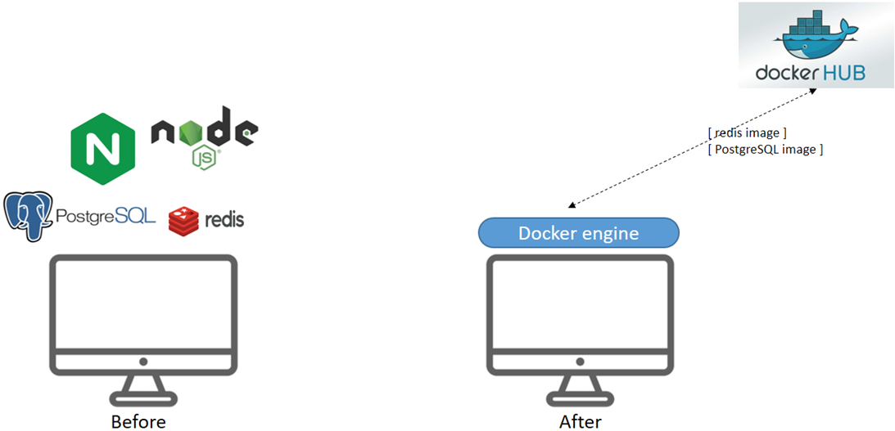
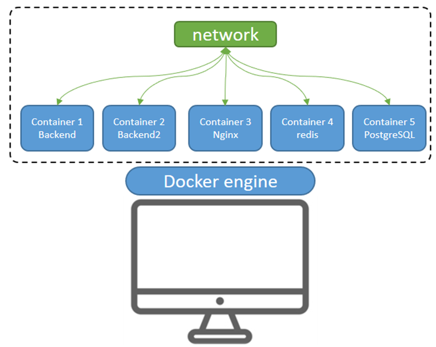

這一篇文章主要介紹Docker, 並將前面專案所用到的所有技術都轉成Docker。 (Backend, Nginx, Redis, PostgreSQL)


# 主要流程

1. Docker 介紹
2. Docker 使用
3. Docker Compose


#  Docker 介紹

Docker 是一個開源的容器化平台，能夠將 `應用程式與其執行環境` 打包成 <u> 輕量且可攜帶</u> 的容器（Container）。這些容器在任何有安裝 Docker 的系統上，都能一致且快速地運行，避免「環境不一致」的問題。

Docker 利用的是 Linux 核心的 Namespace 和 cgroups 技術。

- Namespace : Linux 隔離機制。將系統資源"虛擬化"，分配給每個容器。總共有六種類型
- Control Groups (cgroups) : 控制每一個隔離容器可使用的資源，避免單個Container使用完所有系統資源。

## Docker 核心組件

- 映像檔 (Image) : "應用程式"運行所需的所有內容，並以此建立容器 (Container)。
- 容器 (Container) : `基於映像檔`產生的輕量級且資源隔離的`運行環境`。
- Docker Engine : 兩部分組成 : 
    - Docker Daemon (守護進程) : 負責`容器生命週期管理`，包含建立、啟動、停止和刪除。
    - Docker Client (客戶端) : `用戶與Docker互動`的命令行工具，發送指令給Daemon。
- 倉庫 (Registry) : 存放和管理Image的集中倉庫。常用的是`公開`的 Docker Hub，也可自行搭建`私有倉庫`。


使用流程說明 (安裝完 Docker):

1. 使用者輸入指令，例如 `docker run redis` ， Docker client會將其送給Docker Daemon
2. Docker Daemon 先在`本地尋找 redis Image"` ，若未找到，則會去預設 `Docker Hub`搜尋並下載
3. 下載完之後，Docker Daemon `根據 "redis Image" 創建一個Container 實例`。
4. Container啟動成功後，裡面就會運行 Redis服務。

---

## 為什麼要使用 Docker？

- **環境一致性**  
  將應用及所有依賴包裝在容器中，不論開發、測試或生產環境，都能保證相同的運行條件，`減少「我機可運行，他機無法運行」`的狀況。

- **快速部署與啟動**  
  容器啟動速度快，不需要啟動完整作業系統，`節省開發和部署時間`。

- **彈性與擴展性**  
  容器`易於複製和擴展`，方便建構微服務架構及自動化部署流水線 (CI/CD)。


在尚未使用Docker之前 (左圖)，我們的主機需要`安裝各種軟體以及相依套件`，導致系統環境日益複雜，且隨著安裝的軟體增加，問題也愈發明顯。

但是使用Docker之後，我們只需要在主機上`安裝 Docker engine 就好` (右圖) 。即便未來有 100 種軟體需要使用，只需要去`倉庫 (Docker Hub)` 裡面下載對應的 Image，主機就可以直接使用這項軟體了。



---

## Docker 與 VM 

在Docker 尚未推出時，是透過建立 VM (Virtual Machine) 來解決「環境不一致」的問題。

VM 其實就是一台完整功能的電腦，只不過是虛擬的。由一台實體電腦所模擬出來。<br>


為甚麼要由一台實體電腦模擬一台虛擬電腦出來? 是因為`當你只有一台電腦，卻同時需要 Windows 的環境 和 Linux 的環境的，甚至更多不同環境`。

如果沒有VM，你只能:
- 方法1 : 買很多台實體電腦，各自灌不同作業系統
- 方法2 : 當你想要用Linux的時候，把電腦重灌成Windows；當你想用Windows的時候把電腦重灌成Linux。

顯然兩種方法都不太可能，因此VM誕生了。

想在自己的電腦中建立VM，有兩個條件。第一個是確認自己的CPU 是不是有支援虛擬化技術 ，再來就是在自己的電腦上安裝Hypervisor。ex: VirtualBox。這樣你的電腦就具備打造 VM 的 能力了。


| 特性           | Docker 容器                     | 虛擬機（VM）                        |
|--------------|----------------------------|--------------------------------|
| 是否需要硬體虛擬化支援 | 不需要                         | 需要       |
| 隔離方式         | 利用 Linux kernel namespace 和 cgroups | 利用 Hypervisor 模擬完整硬體及 OS     |
| 資源消耗         | 輕量，共用核心                   | 重，需運行完整 OS                   |
| 作業系統彈性   |  必須與宿主機核心相容（通常 Linux）  |可跑不同作業系統（Linux、Windows等）|

---


如何選擇?  

- VM : 完整、獨立且強隔離的系統環境，或運行不同作業系統
- Docker : 快速啟動、輕量、易於擴展及持續交付，特別是微服務架構


# Docker 使用


根據過去的專案所使用到的技術，現在要將其全部轉換為Docker啟用。
- 後端開發程式
- 前端＆Nginx
- Redis
- PostgreSQL
  
在轉換時須先注意一件事，那就是前面說到的 Container 的資源是隔離的，包含`網路`，所以可想而知 Container 跟 Container 彼此之間是無法連線的。
因此需要建立 Container 的網路橋接。

```bash
# 建立 1 個 network , 叫做tech-showcase-net
docker network create tech-showcase-net

# 可以透過 inspect檢查現在有哪些Container使用這個network
docker network inspect tech-showcase-net
```


## 後端開發程式

```bash 

#修改config/index.js , 以前是帶入ip , 改換成container name
host: process.env.REDIS_HOST || 'my-redis',
host: process.env.DB_HOST || 'my-postgres',

# 啟用兩個後端
docker run -d \
  --name backend \
  --network tech-showcase-net \
  -p 3000:3000 \
  -v /Users/wupeien/Desktop/GitHib/tech-showcase-chat/backend:/app \
  -w /app \
  node:20 \
  sh -c "npm install && npm run dev"


docker run -d \
  --name backend2 \
  --network tech-showcase-net \
  -p 3001:3001 \
  -v /Users/wupeien/Desktop/GitHib/tech-showcase-chat/backend:/app \
  -w /app \
  node:20 \
  sh -c "npm install && npm run dev"


# 透過logs 去檢查backend是否順利執行
docker logs backend
```

## 前端＋Nginx

```bash
# 1. 修改掛載到 Container 的nginx.conf 

# 1.1 root的位置更改為/usr/share/nginx/html （建立Docker時會設定）
root   /usr/share/nginx/html;

# 1.2 把server指定ip 改成 後端container的名稱 （backend, backend2)
upstream api_upstream {
    # ip_hash 確保同一個用戶的請求發送到同一個後端，利於 Session 維護
    ip_hash; 
    server backend:3000;
    server backend2:3001;
}

#  2. 建立 Nginx Container (Port 8080)
docker run -d --name my-nginx \
  --network tech-showcase-net \
  -v /Users/wupeien/Desktop/GitHib/tech-showcase-chat/dist:/usr/share/nginx/html:ro \
  -v /Users/wupeien/Desktop/GitHib/tech-showcase-chat/nginx/nginx.conf:/etc/nginx/nginx.conf:ro \
  -p 8080:8080 nginx


# 如果之後前端更新了，要將新的打包檔 /dist 給nginx，可以執行下列
# 它會將前端的程式碼進行 npm run build, 並把 /dist 放到tech-showcase-chat/dist，不需要restart就可以直接看到畫面更新了
docker run --rm \
  -v /Users/wupeien/Desktop/GitHib/tech-showcase-chat/frontend:/app \
  -v /Users/wupeien/Desktop/GitHib/tech-showcase-chat/dist:/app/dist \
  node:20 /bin/bash -c "cd /app && npm install && npm run build"


# 補充說明：Nginx官方預設的 Docker
/etc/nginx/nginx.conf        ← 主設定檔
/usr/share/nginx/html        ← 預設網站根目錄
:ro ← read only
```

## Redis

其實之前的時候就已經是用Docker 啟用了。只不過這次我們需要將Redis的Container加入網路。

```bash
# 將 my-redis 加入到
docker network connect tech-showcase-ne my-redis
```

## PostgreSQL 

```bash
# 要記得帶入DB資訊才能建立PostgreSQL的Container
docker run -d \ 
--name my-postgres \
--network tech-showcase-net
 -p 5432:5432 \ 
 -e POSTGRES_USER=chat_user \ 
 -e POSTGRES_PASSWORD=chat_user \ 
 -e POSTGRES_DB=ChatRoom \ 
 -v pgdata:/var/lib/postgresql/data \ 
 postgres:15

 # 進入DB
 docker exec -it my-postgres psql -U chat_user -d ChatRoom

 # 列出所有DB
 ChatRoom=# \l

 # 所有訊息
 ChatRoom=# \dt

 # 離開PostgreSQL
 ChatRoom=# \q
```

之前是在Windows直接安裝PostgreSQL，所有資訊都留在那，但現在因為搬到mac上實作Docker，所以要進行資料搬移。
```bash
# steps 1:從原本windows的cmd中，使用pg_dump把資料庫備份
"D:\PostgreSQL\17\bin\pg_dump.exe" -U chat_user -h localhost -p 5432 -F c -b -v -f "D:\backup\ChatRoom.backup" ChatRoom

# steps 2 : 把ChatRoom.backup 搬移到mac桌面 （透過 google drive）

# steps 3: Import 檔案到PostgreSQL 的 Container內

  # 3.1  將檔案從桌面複製一份到Container內
  docker cp ~/Desktop/ChatRoom.backup my-postgres:/ChatRoom.backup
  docker exec -it my-postgres bash  
  ls -l --> 可以看到一份ChatRoom.backup

  # 3.2 :Restore to DB
  pg_restore -U chat_user -d ChatRoom /ChatRoom.backup
```

## 主機架構

如果都安裝好了，你的主機架構大概會變成是這樣。

你的主機上只會安裝 Docker ，並且透過 Docker 去啟用
  - Backend (Node.js)
  - Frontend (Nginx)
  - Redis
  - PostgreSQL
  
在透過一條 network，讓容器間可以相互連接。

如果今天這個服務要下線或是轉移至其他主機，只需要將容器關閉，你的主機又回到乾淨的模樣。
(不會有各種軟體移除後導致的<u>殘留文件或檔案</u>。)

跟之前的主機相比，是不是 <u>**乾淨許多**</u> ?



# Docker  Compose

## 介紹
從剛剛可以看出，為了建立多個 Container，需要分別下各種指令。有時候甚至會搞混自己前面到底下了什麼指令，例如： 
- Container A 有沒有加入 network ? 
- Container 啟動有無按照順序 ? 
- 環境變數怎麼設定？ 

這些問題會隨著服務變多，容器數量增加而愈加複雜。

Docker Compose 正是為了解決「多容器管理」而誕生。名稱中的「Compose」也代表它能將多個 Container 組合起來一併管理。


| 項目             | Docker   | Docker Compose |
|----------------  |---------|------|
| **n 個容器啟動次數**    |  n 次 `docker run`    |  1 次 `docker compose up`|
| **資源共享**           | 無                    | 網路、資料卷(Volume)、環境變數等|
| **撰寫格式**           | CLI指令 或 Dockerfile | Yaml 檔 |
| **容器管理**           | `個別`容器啟用、暫停       | 支援`個別、整組`容器啟用、暫停|
| **維護性**             | 低 (指令/檔案 散落)    | 高 (集中管理)|
| **適用場景**           | 單一服務/快速測試      | 多服務協同運作 (多容器)|


從上述比較表可以大致整理出 Docker Compose 特點 : 

-  `快速和方便管理`多容器 :  一份 Yaml 配置檔即可管理多個容器。
-  適合`協同合作服務` : 在資源共享的情況下，方便各個容器之間相互使用。

## 使用

將前面透過 CLI 逐步建置的Docker指令，轉換成 一個 docker-compose.yml。

```bash
version: "3.9"

services:
  nginx:
    image: nginx:latest
    container_name: my-nginx
    ports:
      - "8080:8080"
    volumes:
      # 前端 build 出來的靜態檔
      - ./dist:/usr/share/nginx/html:ro
      # nginx 設定檔
      - ./nginx/nginx.conf:/etc/nginx/nginx.conf:ro
    depends_on:
      - backend
      - backend2
    networks:
      - tech-showcase-net

  backend:
    image: node:20
    container_name: backend
    working_dir: /app
    volumes:
      - ./backend:/app
    command: sh -c "npm install && npm run dev"
    ports:
      - "3000:3000"
    depends_on:
      - my-postgres
      - my-redis
    networks:
      - tech-showcase-net

  backend2:
    image: node:20
    container_name: backend2
    working_dir: /app
    volumes:
      - ./backend2:/app
    command: sh -c "npm install && npm run dev"
    ports:
      - "3001:3001"
    depends_on:
      - my-postgres
      - my-redis
    networks:
      - tech-showcase-net

  my-postgres:
    image: postgres:17
    container_name: my-postgres
    ports:
      - "5432:5432"
    environment:
      POSTGRES_DB: ChatRoom
      POSTGRES_USER: chat_user
      POSTGRES_PASSWORD: chat_user
    volumes:
      - pgdata:/var/lib/postgresql/data
    networks:
      - tech-showcase-net

  my-redis:
    image: redis:latest
    container_name: my-redis
    ports:
      - "6379:6379"
    networks:
      - tech-showcase-net

networks:
  tech-showcase-net:
    driver: bridge

volumes:
  pgdata:
    external: true

```

接下來就只需要在 docker-compose.yml 的路徑下輸入 `docker compose up -d` ，就會自動啟用所有 Container了。

```bash
# 如果你的db是全新的，沒有任何資訊，要記得把最後的 external: true拿掉
# 專案有附上我的 ChatRoom.backup ，若是不想重建整個Postgres，可以按照上面的方法直接匯入

# 常用指令
docker compose logs -f backend --> 即時觀看 log
docker compose down --> 關閉所有 Container
docker compose restart --> 重啟所有 Container
docker compose restart backend --> 重啟特定 Container
docker-compose exec -it my-redis redis-cli --> 進入 my-redis (Container) ， 透過"偽終端機" (-t) "互動式介面"(-i) 來啟用 "Redis指令列介面"(redis-cli) 
``` 


# 延伸討論

下一篇將要討論的是時下流行的效能監控軟體  : **Prometheus + Grafana**