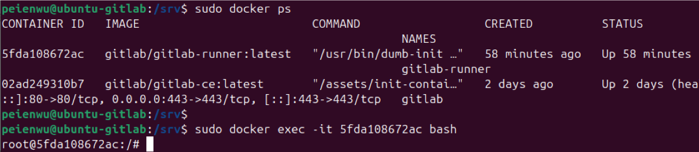
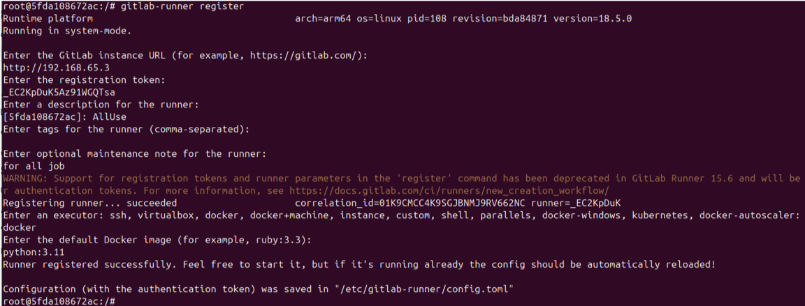
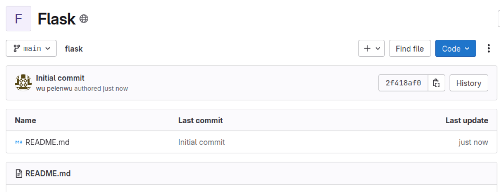
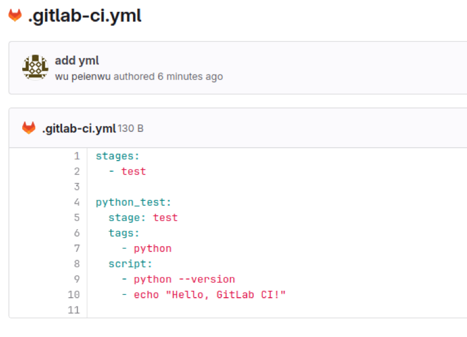
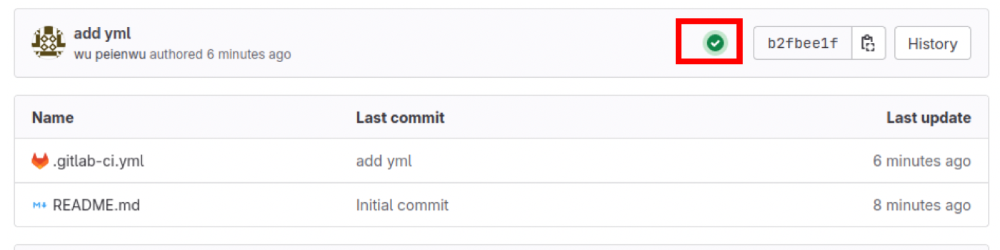
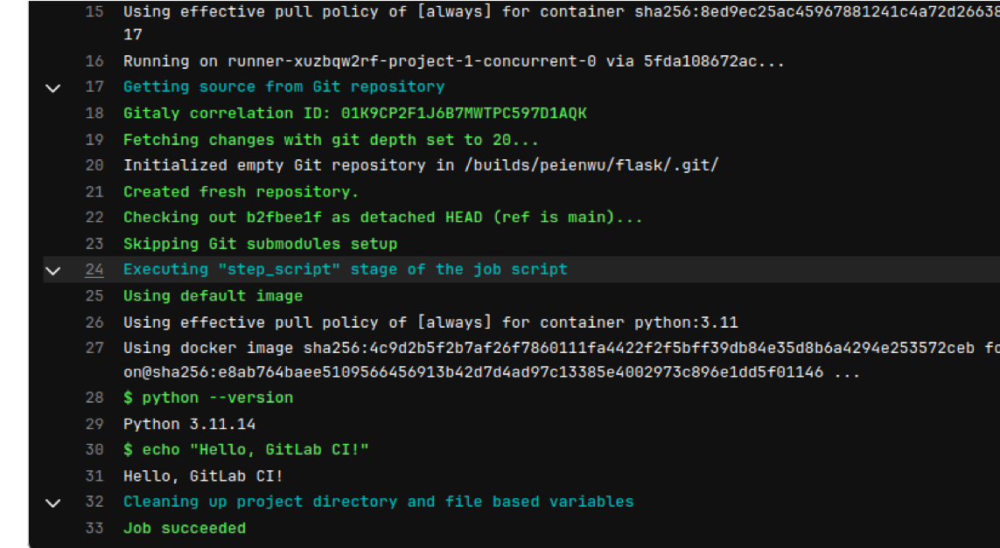
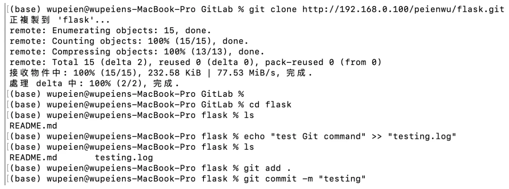
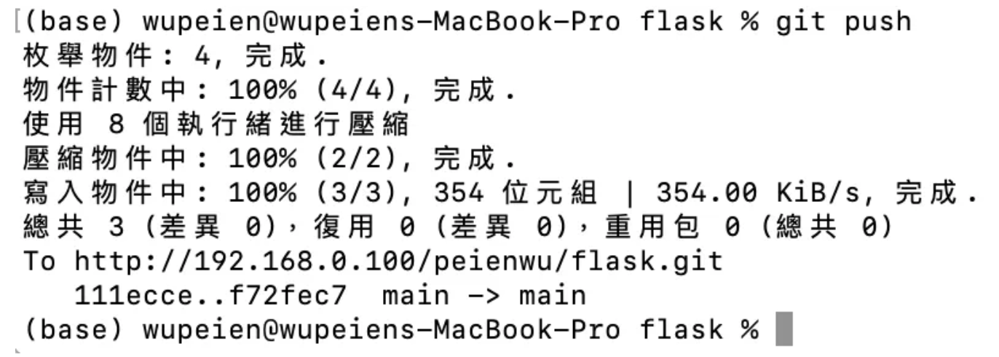
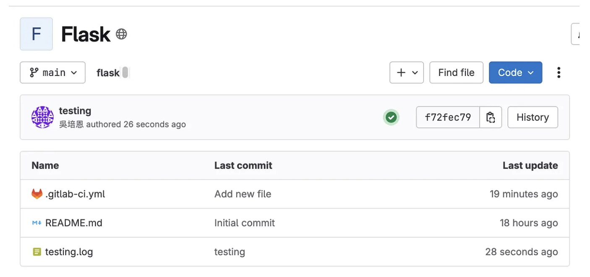

GitLab CI/CD 從GitLab建置開始


目標 : 學習Gitlab CI/CD<br>
說明 : 現行軟體開發都會用CI/CD進行測試和部屬，減少人為操作減少錯誤發生。
但因工作上不會使用所以自己上網學。這次主要從GitLab Server開始架設，一路到上傳檔案觸發pipeline。

# 主要流程:

  1. 介紹GitLab
  2. 架設GitLab Server (Docker)
  3. 架設GitLab Runner (Docker) + 建立Runner


## 介紹GitLab
在 GitLab CI/CD 流程中，**GitLab** 與 **Runner** 是兩個核心組件，它們的關係如下：

### 1. GitLab
- GitLab 是 **版本控制平台 + CI/CD 管理系統**
- 功能：
  - 儲存程式碼（Git repository）
  - 管理專案、權限與協作
  - 定義 CI/CD pipeline（透過 `.gitlab-ci.yml`）
  - 負責 **排程、管理與監控 pipeline 執行狀態**

> 簡單來說，GitLab 是「指揮中心」，負責決定什麼任務要執行。

---

### 2. GitLab Runner
- Runner 是 **實際執行 pipeline job 的 agent**
- 功能：
  - 接收 GitLab 分配的 job
  - 在指定的 executor（如 Docker、Shell、Virtual Machine）中執行 job
  - 將結果回傳給 GitLab

> 簡單來說，Runner 是「工人」，真正幫你跑程式、測試、部署。

---

### 3. GitLab vs Runner 

1. 開發者 push 代碼到 GitLab 專案
2. GitLab 解析 `.gitlab-ci.yml`，生成 pipeline
3. Pipeline 被拆成一個個 job
4. GitLab 將 job 發送給 **可用的 Runner**
5. Runner 在指定環境中執行 job（測試、建置、部署等）
6. Runner 將執行結果回報給 GitLab
7. GitLab 顯示 pipeline 狀態（成功/失敗/日誌）


## 架設GitLab Server (Docker)

就是架設一個跟 **[官方](https://gitlab.com/users/sign_in)** 一樣的Server, 不過所有設定你都可以自由調整。<br> 首先，安裝ubuntu環境，可以按照 **[影片](https://www.youtube.com/watch?v=hWH4n9zB7mk)** 上去安裝。(需要有Ubuntu Desktop，影片也有教)

### Linux 建置

1. 更新ubuntu的package, 提升穩定性與安全性 (新版本通常會修改漏洞)<br>
    ```markdown
    sudo apt update && sudo apt upgrade -y
2. 安裝Docker
    ```markdown
    #安裝Docker
    sudo apt install -y docker.io 
    #檢查是否啟用
    systemctl status docker
3. 安裝GitLab Server
    ```markdown
    sudo docker run --detach \  #背景執行
    --hostname 192.168.0.100 \
    --publish 443:443 --publish 80:80 --publish 22:22 \
    --name gitlab \     #這個Container的名稱
    --restart always \  #開機是否自動啟用
    --volume /srv/gitlab/config:/etc/gitlab \   #容器內目錄etc掛載於本地端srv
    --volume /srv/gitlab/logs:/var/log/gitlab \ #容器內目錄etc掛載於本地端srv
    --volume /srv/gitlab/data:/var/opt/gitlab \ #容器內目錄etc掛載於本地端srv
    gitlab/gitlab-ce:latest  #這個Container要用哪個image開啟
若看到名字叫做gitlab的Container成功建立，代表GitLab Server已啟用，<br>
打開瀏覽器輸入hostname(192.168.0.100)就可以進入GitLab 首頁。預設Admin帳號 : root，初始密碼需要下指令獲取
```markdown
  sudo docker exec -it gitlab cat /etc/gitlab/initial_root_password
```

### 其他功能
```markdown
# 忘記密碼? 用指令重新設定user密碼。 ex:[root]
  sudo docker exec -it gitlab gitlab-rake "gitlab:password:reset[root]"

# Ubuntu重新開機可以自動啟用GitLab (兩步驟)
  [1] Docker設定開機自動啟用
      sudo systemctl enable docker

  [2] Docker中的gitlab Container 設定開機自動啟用(--restart always)
      sudo docker update --restart=always gitlab
   

## 目前 Docker開機自動啟用設定值
  systemctl is-enabled docker
## 目前 gitlab Container 開機自動啟用設定值
sudo docker inspect -f '{{.HostConfig.RestartPolicy.Name}}' gitlab
```


## 架設GitLab Runner (Docker) 
很簡單，透過docker方式建即可，指令參數的功能跟剛剛差不多。
### 安裝 Runner 軟體
```
# 安裝Gitlab Runner
sudo docker run -d \
  --name gitlab-runner \
  --restart always \
  -v /srv/gitlab-runner/config:/etc/gitlab-runner \
  -v /var/run/docker.sock:/var/run/docker.sock \
  gitlab/gitlab-runner:latest

# 檢查Runner有無啟用
sudo docker ps
```
### 註冊 Runner
架設完成後，要註冊Runner。方法有蠻多種的：<br>
  1. GitLab Server的Web上註冊
  2. OS層用command註冊
     1. 交談式 (下述案例)
     2. 非交談式
   
Runner可以註冊多個，每個Runner可以針對不同專案、需求，去執行各自的pipeline
``` markdown
# 找出gitlab-runner的Container ID
sudo docker ps 
# 進入這個Container
sudo docker exec -it {Container ID} bash

#進入後，直接下指令進入交談式註冊
gitlab-runner register
# 接下來就會要求你輸入 GitLab URL, GitLab token, ... 
# 按照其要求輸入即可 (GitLab token可以到GitLab Server的admin Runner中找到)
```
  
  

# 測試結果

先到GitLab建立Project (Repository)


## 測試方法 1 - Web操作
新增檔案 .gitlab-ci.yml，新增完後會直接觸發PipeLine，綠色勾勾代表執行成功。



點進去可以看到這次pipeline的執行紀錄，並對照gitlab-ci是否相同。


## 測試方法 2 - Git指令

透過git clone先下載repository，並且新增一個檔案叫做testing.log，再把檔案push上去。最後會看到一樣的pipeline執行結果。






成功
