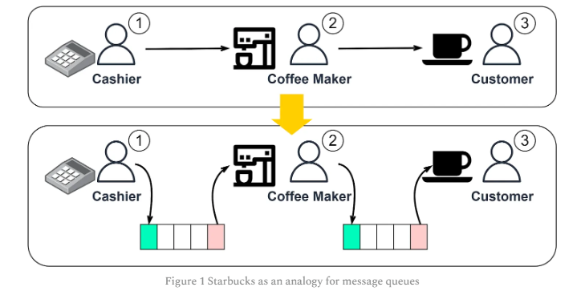
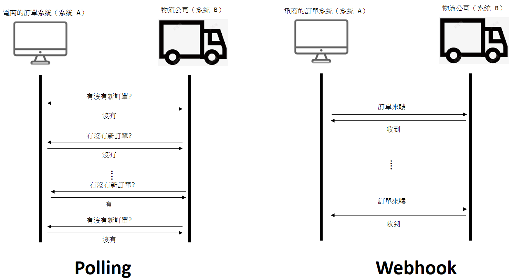
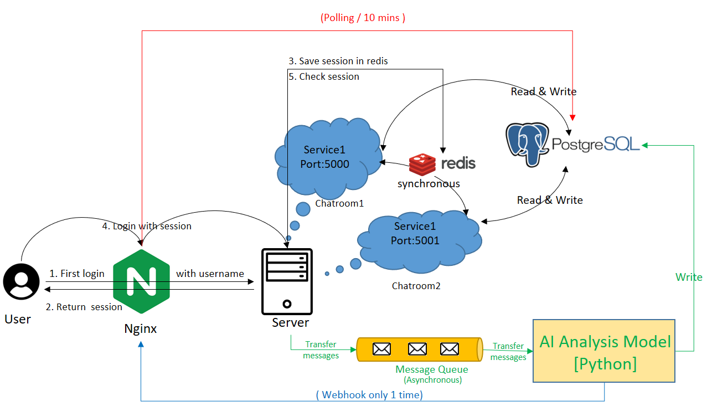
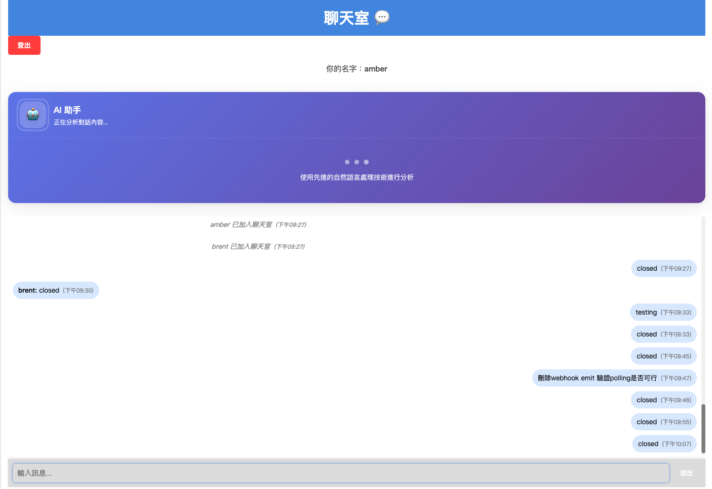
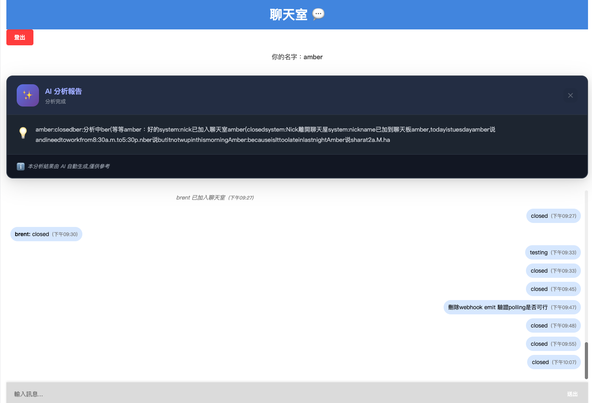
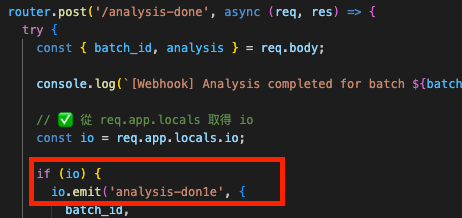
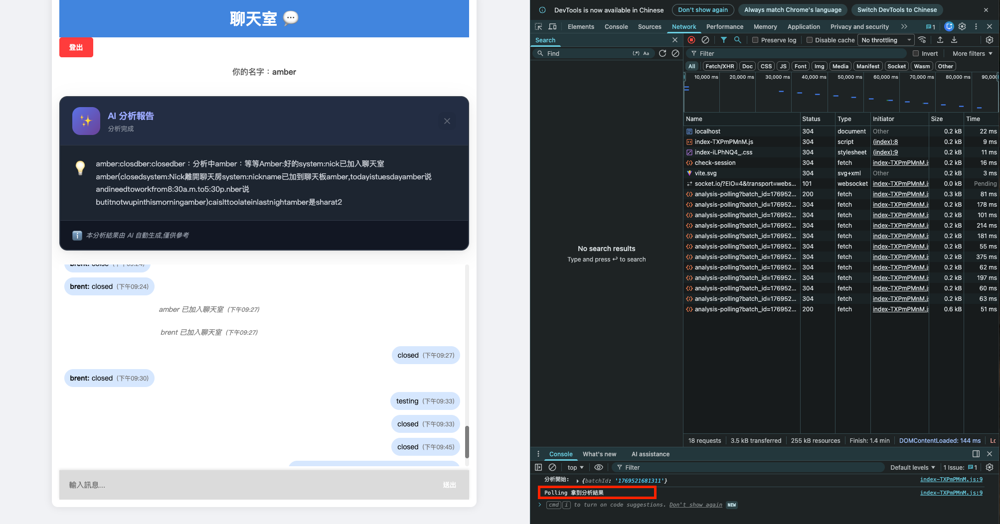

# 主要流程

1. Message Queue 介紹
2. AI 模型介紹
3. 事件通知機制
4. 實作MQ + AI分析 

## Message Queue 介紹

Message Queue(MQ, 訊息佇列)，一種中介軟體。常用於不同系統之間的資料交換。最大的特色就是在交換資訊時可以實現 "非同步" 。

在 [Here](https://blog.bytebytego.com/p/why-do-we-need-a-message-queue?open=false#%C2%A7benefits-of-message-queues) 看到一個不錯的舉例，就是星巴克點餐的流程，

- 同步處理 (Before) : 當店員結完帳要把訂單交給咖啡師，如果咖啡師正在忙，那店員就會停在那邊，直到親手把訂單交給咖啡師，店員才會幫下一位客人點餐。

- 非同步處理 (After) : 店員結完帳要把訂單交給咖啡師時，只需要按照順序放在旁邊，就可以繼續幫下一位顧客點餐，不需要管咖啡師是不是在忙、有沒有空。只要確定訂單有依序且指定給咖啡師即可。 

這樣的事情放在系統上就等同於：
- 同步處理 (Before) : 當 A 系統要把資料傳給 B系統，如果 B 系統目前離線或是忙碌無法回應是， A 系統會一直建立連線並且等待B系統，直到 B 系統回應說我收到了，A 系統才會繼續做下一件事。

- 非同步處理 (After) : 當 A 系統要把資料傳給 B系統，只要把檔案丟到 MQ 裡面，就可以繼續做下一件事情，不需要管 B 系統現在是不是忙碌或是離線。而 MQ 本身會按照順序將內容傳遞給 B 系統 。

<figure style="text-align: center;">
  
  <figcaption><a href="https://blog.bytebytego.com/p/why-do-we-need-a-message-queue?open=false#%C2%A7benefits-of-message-queues">圖片來源</a></figcaption>
</figure>

#### MQ 特色:

- 非同步處理 (Asynchronous) : 交換資料時不需要雙方即時連線，只要將資料丟入MQ後就可以結束。
- 系統間解耦 (Decoupling) : 兩個需要交換資料的系統，不須直接溝通，彼此獨立發展和擴充。
- 水平擴展 (Scalability) : 基於解偶，適合擴展增加其他系統，甚至單一系統的多實例。
- 可靠傳輸 (Reliability): 確保訊息不會丟失，即便傳輸失敗也會保留於佇列中。 

#### MQ 缺點

- 系統複雜度增加 : 不只要額外安裝 MQ 服務，甚至原本相互溝通的兩個系統都要增設 MQ 的 轉送格式。

- 降低系統可用性 : MQ 如果壞了，相依的全部系統可能也都無法運作。

- 成本增加 : 基於複雜度提升，需花更多人力去維護。

- 資料一致性差 : MQ可以確保資料成功交到對方手上，但無法確保該資料是不是成功執行完成。例如:生產者(發送方)成功將資訊放到MQ並轉交給消費者(接收方)，但消費者(接收方)寫入成功或失敗 生產者(發送方)不會知道。若失敗，就會導致雙方資料不一致。
    - MQ內有消費者確認機制 (ACK)，消費者一定要 "確定" 成功完成後再回傳 ACK給MQ，讓MQ知道你已經成功接收且完成，MQ才會把這筆資訊刪除。
    - 消費者的設計，不可以是 "成功接收到訊息" 就回傳 ACK；要 "成功完成任務"後會傳ACK

所以 MQ 就是一個負責接收、傳送的中介系統，可以提供系統之間 "非同步處理" 資訊的功能，並確保資訊可以正確傳遞，但同樣的需要額外花費人力維護。

### 何時使用MQ (When)

- 搶票系統 (流量消峰) : 瞬間產生大量流量的情況下，容易把系統搞到崩潰。可以把流量導入到 MQ ，系統再依據其效能去 MQ 依序處理。

- 日誌系統 : 如果有使用 ELK 這種日誌分析系統，需要收集來自各個系統的日誌。而各個系統再將日誌傳送給 ELK 時，可以透過 MQ 實現非同步處理。

- 電商訂單 : 訂單確定後，將訂單資料送入 MQ，後端庫存扣減、支付、物流等服務進入非同步處理，解耦系統並提升整體處理彈性 ; 因活動 (雙11) 大量湧入訂單時也可達到流量消峰。

## AI 模型介紹

AI (Artificial Intelligence，人工智慧) 範圍相當廣泛，廣義上指的是 `任何能讓機器模仿人類智慧的科技或技術`，包括機器學習 (Machine Learning)、深度學習 (Deep Learning) 等多種方法。

目前`大家最常聽到的 AI，大多數是基於「深度學習」技術`。深度學習是利用類神經網路 (Neural Networks) 模擬人腦運作，處理龐大資料並自動學習規律的一種方法。ChatGPT 就是使用大型語言模型 (Large Language Model, LLM) 所建立的應用。而「語言模型」是自然語言處理 (Natural Language Processing, NLP) 領域中重要的一種模型，目標是讓`電腦能理解人類語言文字的結構和意義，並能夠生成有意義的文字回應`。

當然，深度學習不只用來解決 NLP 領域，常見的還有影像辨識CV、股票交易FinTech 等等。

---

而本次使用到的應用，主要是將聊天室的訊息透過AI模型分析出重點摘要。

## 事件通知機制

兩個系統間相互協助時，常需通知對方已完成某項工作，讓對方接續執行後續流程。常用的技術有 Polling 與 Webhook。以下用電商訂單處理 + 物流配送說明：

前提 : 電商的訂單系統（系統 A）負責接收訂單，物流公司（系統 B）則依據訂單狀態安排配送。

### Polling (輪詢)

實現方法是物流公司 (系統 B)每隔一段時間就去電商的訂單系統 (系統 A) 查詢，檢查是不是有新訂單，再根據狀況安排配送。所以 Polling 的方法就是 `系統B不斷的去詢問系統A的訂單狀況。`

- 優點 : 實現簡單、不需發送方額外配合
- 缺點 : 資源消耗大、延遲高、伺服器和網路高負載

### Webhook 

如果是使用 Webhook 的方式，實現方法是電商的訂單系統（系統 A）在確認訂單後，主動告知 系統B 有這一筆新訂單。所以 Webhook 的方法就是 `系統A主動告知系統B訂單狀況`

- 優點 : 即時通知、資源利用率高
- 缺點 : 實現複雜且須雙方配合、資安風險

### Polling vs Webhook 

兩個完全不同的機制，各有優缺點與適用場景。但在實務中`完全可以搭配使用，而非只能二擇一。` 常見的組合就是 `Webhook 為主，Polling 為輔`。

Webhook 可即時主動推送事件，確保快速通知；而當 Webhook 因故障或訊息丟失時，Polling 作為備援機制，以較低的頻率主動查詢相關資訊，確保資料一致。如此，便可兼顧即時性和系統可靠性。

不過，同時使用兩種方法確實會增加整體系統負擔，尤其 Polling 頻率若過高，會造成額外資源消耗。因此在搭配使用時，應合理設計 Polling 頻率和重試機制 (retry) ，平衡系統效能與穩定性，換取更高的可靠度。

| 特色        | Polling                      | Webhook                       |
|------------|-----------------------------|------------------------------|
| 通訊方式    | 接收方定期主動查詢             | 發送方事件發生主動推送           |
| 延遲        | 較高，取決於輪詢間隔           | 低，接近即時                   |
| 流量與成本  | 高，容易造成浪費               | 低，節省網路及資源               |
| 實現難度    | 簡單                         | 較複雜，需安全機制與可用接收端     |
| 適用場景    | 即時性要求不高、系統限制多       | 即時通知、事件驅動架構           |

## 實作MQ + AI分析 

聊天室專案加入了 : 

- 後端 (Node.js)
  - 偵測使用者是否輸入 "closed" ，以此作為 AI 分析的啟動條件
  - 撈取 PostgreSQL 最新的 50 筆訊息
  - 建立 MQ 用以傳遞訊息給 AI Analysis Model
  - 建置 API 提供 AI Analysis Model (webhook) 跟 前端使用 (Polling)

- AI Analysis Model (Python) 接收到訊息後 : 
  - 透過 NLP 分析 訊息摘要
  - 將訊息摘要寫入資料庫
  - 呼叫後端 API 告知已完成分析 `(Webhook)`

- 前端 (React)
  - 定時呼叫後端API 檢查分析結果 (Polling)
  - 顯示分析結果

流程說明 : 
  
1. 後端接收到 "closed" 後，去PostgreSQL 撈取最新的50筆訊息
2. 將訊息透過 MQ 傳遞給 AI Analysis Model
3. Socket emit 通知 前端開始 Polling
4. AI Analysis Model 接收到訊息後開始分析 (此時前端不斷在 Call後端 API 實現Polling )
5. 分析完成後，將結果寫入資料庫
6. Call 後端API，告知已完成分析同時傳遞結果
7. 後端收到結果後，帶著結果通知前端
8. 前端收到結果後，將結果顯示於網頁，並且結束 Polling。

**使用者輸入 "closed"**

**AI 分析完成 (Webhook)**

**AI 分析完成 (Polling)**

後端收到 AI Analysis Model 的 Webhook通知時，不要傳給前端 (亂改 emit 資訊)

前端分析的結果是利用Polling 獲取的。

