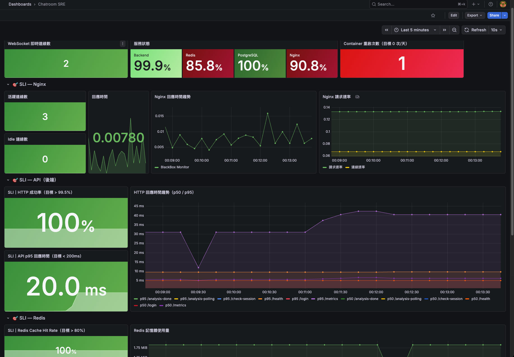
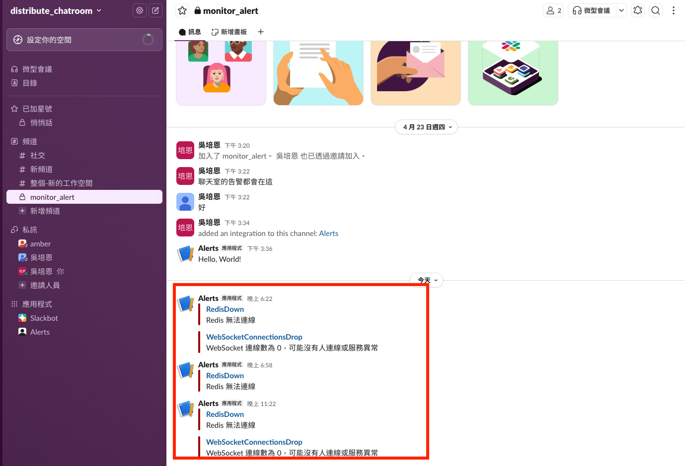

# 監控與可觀測性（Observability）

當公司的產品服務出現問題時，你希望是**主動發現**還是**被用戶回報**？

可觀測性（Observability）就是讓你在問題發生前就能察覺異狀的能力。
它不只是「知道系統壞了」，而是能回答一個更難的問題：

> **「為什麼壞了？」**

---

## 可觀測性的三本柱

可觀測性由三個維度組成 (Metrics、Logs、Traces)，缺一不可。

### Metrics（指標）
數字化的系統狀態，隨時間記錄。

- CPU 使用率、記憶體使用量
- 每秒請求數（RPS）
- API 回應時間（p50 / p95 / p99）
- 錯誤率（Error Rate）

**特性**：低成本、可聚合、適合畫趨勢圖和設定告警。
**缺點**：只知道「發生了什麼」，不知道「為什麼」。

### Logs（日誌）
系統在特定時間點發生的事件記錄。

```
2024-03-01 14:23:11 [ERROR] Redis connection timeout after 3000ms
2024-03-01 14:23:12 [WARN]  Message delivery failed, retrying (1/3)
2024-03-01 14:23:15 [INFO]  User 42 joined chatroom 1
```

**特性**：細節豐富、可搜尋、適合事後調查。
**缺點**：量大、成本高、難以跨服務關聯。

### Traces（追蹤）
一個請求從進入系統到回應的完整路徑。

```
Request ID: abc-123
├── Nginx          2ms
├── Node.js        45ms
│   ├── Redis      3ms   ← 正常
│   └── PostgreSQL 40ms  ← 這裡慢了！
└── Total          47ms
```

**特性**：能找出跨服務的瓶頸，是分散式系統的必備工具。
**缺點**：實作成本最高，需要修改程式碼埋點。

---

## 三者的關係

|  | Metrics | Logs | Traces |
|---|---|---|---|
| 問「什麼發生了？」 | ✅ | ✅ | ✅ |
| 問「為什麼發生？」 | ❌ | ✅ | ✅ |
| 問「哪裡發生的？」 | ⚠️ | ✅ | ✅ |
| 儲存成本 | 低 | 高 | 中 |
| 適合告警 | ✅ | ⚠️ | ❌ |

實務上的工作流程通常是：
1. **Metrics 告警** 觸發，發現錯誤率上升
2. 查 **Logs** 找到具體的錯誤訊息
3. 用 **Traces** 定位是哪個服務、哪個環節出了問題


---

## 什麼是好的 Alert？

Alert（告警）的目的是讓對的人，在對的時間，知道對的事情。

### 特性

**1. 對應真實的用戶影響**

- 壞的告警：CPU 使用率 > 80% 
- 好的告警：API 錯誤率 > 1% 持續 5 分鐘
  
CPU 高不代表用戶有感受到問題；錯誤率高才是用戶實際受到影響。

**2. 有明確的行動指引（Runbook）**

每一條 Alert 都應該搭配一份文件說明：
- 這條 Alert 代表什麼意思？
- 如何確認問題？
- 如何修復？
- 升級聯絡誰？

**3. 可以被人處理**

如果收到告警卻不知道能做什麼，這條告警就是無效的。

---

## 怎麼避免 Alert Fatigue？

Alert Fatigue（告警疲勞）是指：告警太多、太吵，工程師開始習慣性忽略它，最終導致真正的問題被錯過。

### 常見的錯誤

- 對每個指標都設告警
- 閾值設得太低（CPU > 60% 就告警）
- 沒有分優先層級，所有告警都用同樣的方式通知
- 同一個問題觸發十條不同的告警

### 解決方式
**分層告警**

| 優先級 | 條件 | 通知方式 |
|--------|------|----------|
| P1（立即處理） | - 服務完全不可用<br>- 錯誤率 > 5% | 電話 / PagerDuty 叫醒 On-call |
| P2（一小時內處理） | - 錯誤率 > 1% 持續 15 分鐘<br>- p99 回應時間 > 2 秒 | Slack 通知 |
| P3（下個工作天處理） | - Redis 記憶體用量 > 70%<br>- DB 連線數接近上限 | Email 或 Dashboard |

**設合理的觀察窗口**

不要讓瞬間的尖峰觸發告警：

```yaml
# 差：瞬間超過就告警
alert: HighErrorRate
expr: http_error_rate > 0.01

# 好：持續 5 分鐘才告警
alert: HighErrorRate
expr: http_error_rate > 0.01
for: 5m
```

**定期清理無效告警**

每個月回顧一次告警列表：
- 過去三十天沒有觸發過的 → 考慮移除
- 觸發了但沒有人處理的 → 降低優先層級或移除
- 同一個問題觸發多條的 → 合併


---
## 實際監控聊天室

1. 後端 Node.js 用 prom-client 暴露你想要監控的 metric
2. Nginx, Redis, PostgreSQL 都有 exporter 可以使用
3. 設定 Prometheus 的 scrape_configs 
4. 設定 alertmanager 觸發告警的條件以及告警對象 (Slack , Create New App) 

<figure style="text-align: center;">
  
  <figcaption>針對 SLI 進行監控設定</figcaption>
</figure>


<figure style="text-align: center;">
  
  <figcaption>針對 SLI 進行監控設定</figcaption>
</figure>


---

## 小結

可觀測性不是一個工具，而是一種思維方式：
系統發生什麼事，你應該要能**主動知道**，而不是等用戶告訴你。

Metrics 讓你知道「發生了什麼」，
Logs 讓你知道「為什麼」，
Traces 讓你找到「在哪裡」。

三者結合，加上設計良好的 Alert，才能讓 SRE 轉被動為主動。


