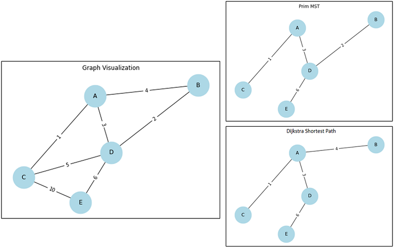

## MST vs Shortest Path Problem

- 最小生成樹(Min Spanning Tree, MST) : 找出一條走過圖中所有節點，且成本最小的路徑。
- 最短路徑(Shortest Path) : 找出起點到終點的最短路徑

這兩個問題看起來很相似 → MST找出整張圖中成本最小的路徑，那不就是最短路徑嗎?

Ans: 有些是，有些不是

####  解釋

<figure style="text-align: center;">
  
  <figcaption>Prim vs Dijkstra</figcaption>
</figure>

透過上圖  `MST - Prim algorithm` 的走法和 `Shortest path - Dijkstra algorithm` 的走法，可以看出只有A → B的路徑不同，其餘相同。

所以首先要知道這兩個方法想要解決的問題是甚麼：

- MST是要找出從起點A(出發地)走遍所有節點(景點)加總的最短路徑。
  
- Shortest Path是要找出從起點A(出發點)到各個節點(景點)的最短路徑。

那麼接下來就可以以圖來說明，以出發點A到B景點來看:

- MST 會選擇走A→D→B，而不是A →B ，因為MST考慮的是`走遍所有景點`，
只要5成本就可以走完B跟D兩個點，誰要用7成本?  
✅ A →D成本是3，D →B成本是2，加總是5  
❌ A →B 成本是4，A→D 成本是3，加總是7  
(如果D →B的成本提高至5甚至更高，那MST才會選擇A →B (D →B設成4的話，因為權重相同所以選哪條都沒差))

- 若用Shortest Path則會選擇走A→B，因為是專注在`出發點A到景點B的最短路徑`，不考慮其他任何成本，所以即便只需要增加1成本就可以多經過一個景點D，但Shortest Path 的思維才不管其他景點有沒有要經過。就是要走離目的地的路徑最短的路

#### 如何選擇用MST or Shortest Path
- 今天如果是規劃2天1夜的行程，包含很多的景點小吃，那就要選擇MST的演算法來決定該怎麼走，這樣可以最大程度節省開車時間和油錢 (每個景點和小吃都會變成圖中的節點)。

- 今天如果是要導航從住家到公司，那就要選擇最短路徑(Shortest Path)，因為它只會思考要如何以最快的方式到達目的地。

---

#### 兩個問題的演算法筆記  [Code Here](https://github.com/Peienn/training_code)

-  Min. Spanning Tree

   - 連通圖、無向圖
   - 不會有cycle
   - 如果Edge的值有重複，則MST就可能會有多個，反之則MST唯一
   - 走完整張圖需要耗費的最小路徑
   - Algorithm: Kruskal, Prim

   1. Kruskal's algorithm: 從最小邊開始加入，只要不造成cycle就一直下去。
        1. 將Edge按照大小排序，因為每次要取出最小的邊
        2. 每個Node都要設定Parent，後面在判斷有沒有cycle的時候用(Find, Union)
        3. 對所有的Edge做迴圈，如果Parent不同的話，代表不是同一個Group(Cycle)，則進行union， 並且將這條邊加入result裡面。

   2. Prim algorithm:
        1. 初始化將所有Node的value="Infinite", parent=Null
        2. 起始點的value = 0 ，並放入Min Heap
        3. 走過的Node要記錄，因為之後不可以再走。每個Node在走的時候將符合資格的邊放入heap (1.鄰居不能被記錄過 2.我到鄰居的距離 < 鄰居當下的距離)
        4. 一直重複值到Heap空了為止

- Shortest Path Problem
    - 連通圖
    - 可以有Cycle
    - 找出起點到各個點之間的最佳路徑
    - Algorithm: Dijkstra(E不可為負值), Bellman-ford, Folyd Warshall

    1. Dijkstra algorithm: 從起點開始， 以自身的值去更新鄰居的值， 再將鄰居放入Heap跑完 (Keypoint : 到自己的距離 + 自己 → 鄰居的值 < 鄰居的值)
       1. 初始話最短路徑的表，起始點設為0，其餘 "Inf"
       2. 透過Queue去跑迴圈，並透過Keypoint的判斷不斷更新最短路徑的表，以及將符合Keypoint的(距離,鄰居)放入Queue