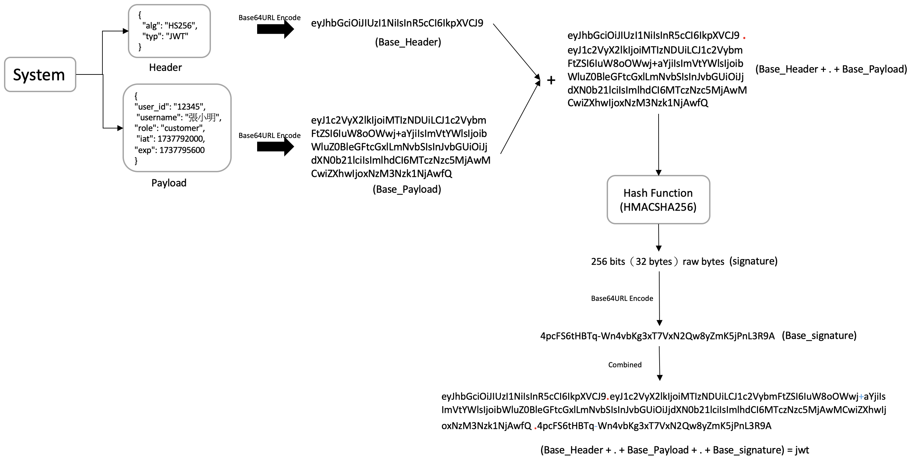
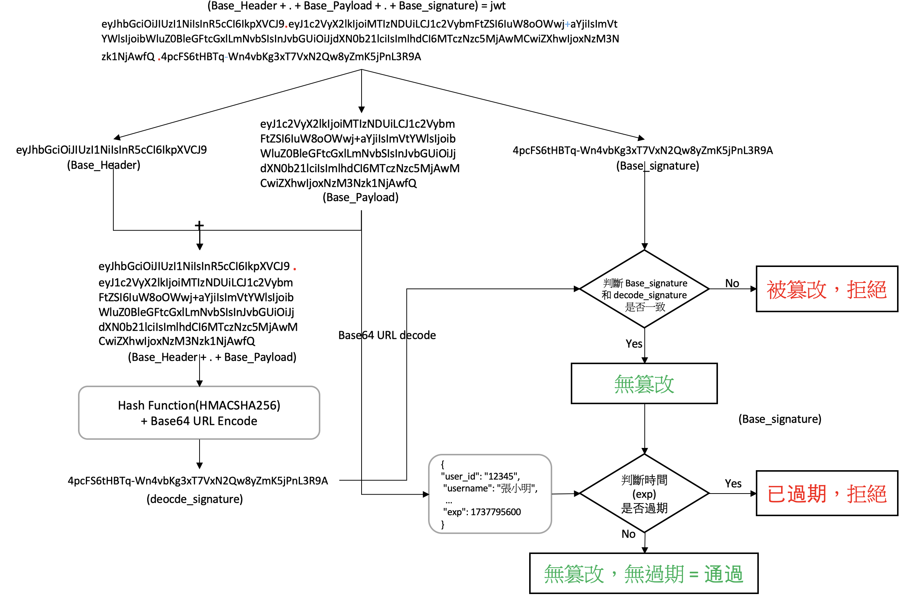
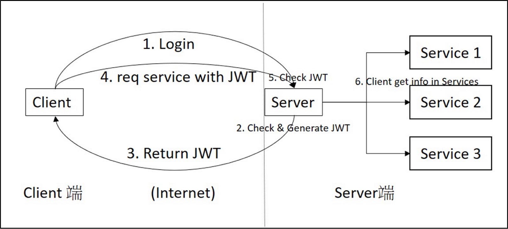

# JWT 介紹

JWT (JSON Web Token) : 一種基於JSON的前端登入驗證機制。其他常見包含 Session+Cookies, OAuth, API Key…

## JWT 結構

- Header : 描述token 類型和加密演算法
- Payload : 實際資料（用戶名稱、權限、有限期限等等）
- Signature : 數位簽名，用於防止竄改

## JWT 發布流程

Client 帶著帳號密碼登入Server，Server確認帳號密碼是否存在資料庫，若存在:

1. 獲取帳號名稱後，搭配其他非機密資訊ex:到期日, 帳號權限, … 組成Payload
2. 產生一組Header (套件可自動產生)
3. 對 Header 和 Payload  進行 Base64Url 編碼
4. 對 `Base_Header.Base_Payload` 進行 Hash → 數位簽名(signature)
5. 對 signature 進行 Base64Url 編碼 
6. 將上述其組成 JWT : [Base_Header . Base_Payload . Base_signature]  (中間用 . 進行區隔)

回傳JWT , 以後Client 使用服務就只需要帶JWT

## JWT 驗證流程

Client將JWT保存，之後只需帶JWT便可要求Server服務，Server 解開JWT , 驗證是否正確

1. 將JWT分割成二個區塊 [Base_Header . Base_Payload] ，[Base_signature] 
2. 對第一個區塊 [Base_Header . Base_Payload] 進行 (Hash + Base64Url 編碼) → 數位簽名(decode_signature)
3. 比對第一個區塊計算得到的數位簽名是否與第二個區塊的數位簽名相同
4. 若不相同則代表資訊被竄改，拒絕連線
5. 相同的話，對Base_Payload 用Base64Url 解碼獲取有效時間，判斷是否過期再決定Client 是否可通過

#### 系統架構圖

## 補充說明

密碼學中，Hash Function的特徵就是不同 input 得到的 Output是不一樣的 (有機會一樣, 稱為"碰種"。但機率低到不可能發生)， Hash Function執行的時候會需要有一組密鑰，透過這個密鑰去做加密，這個密鑰則是Server自行建置和保管。

對於仿造者而言，解開JWT很簡單，透過Base64 Decode就可以打開並獲取資訊， 但是要竄改裡面資訊則是不可能，因為當你傳一個假的JWT給 Server端，Server透過密鑰再次加密時， 發現與原先的結果不相同 (基於Hash的特徵)，因此被拒絕連線。

基本上符合現在JWT的規定下，只有仿造者偷取到Server的密鑰+使用哪種Hash Function，才可以任意生成合法簽名。

