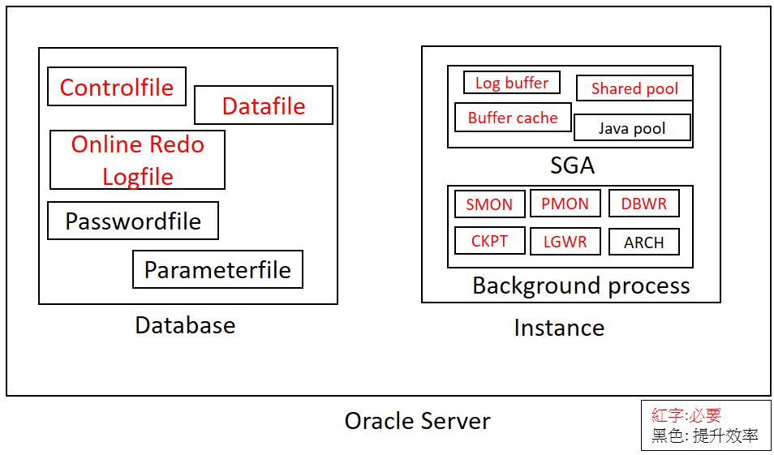
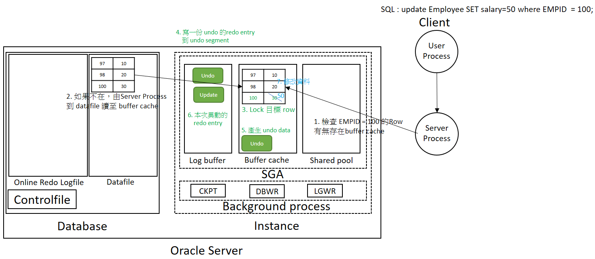

# Oracle Server 資料庫


## 設計架構

Oracle 資料庫主要由兩個部分組成，資料庫(Databae) +  執行處理(Instance)

- Database 是一堆實體檔案，負責保存資料
- Instance 是一堆程式，負責處理資料

### Database

有兩種結構，實體結構 (Physical Structure) 和邏輯結構 (Logical Structure)。

1. 實體結構 : 真實存放在 Disk 的檔案，例如: Controlfile, DataFile 等。
    - Controlfile : 存放資料庫相關的重要資訊，如資料庫的實體結構位置，若是遺失恐導致 Instance 找不到 Datafile，進而影響資料庫無法開啟。最少 1 個，最多 8 個，且每個都要相同。
    - DataFile : 實際存放資料 (Data)，不論是Table、Index 還是資料字典都會放在DataFile內。
    - Online Redo Logfile : 當災難發生時用來還原資料庫的交易。資料庫正常運行下此檔案毫無作用。

2. 邏輯結構 : 記錄資料庫邏輯物件的定義與關聯，是一種抽象結構。主要目的是為了讓資料庫的空間更有效率的使用 [[1]](#1)<a id="b1"> </a>。例如: Tablespace, Segment, Block。<br>
   就好像用windows時，你只知道 C:\Documents\報告.docx (邏輯結構)，但檔案實際上可能分散存在硬碟的不同磁區 (物理結構)。


### Instance 

由兩大部分組成 : System Global Area(SGA) + Background Processes

- SGA : 多種不同的共用記憶體元件組合的區塊，但下列三種是必要的:
    - Shared Pool : 有很多區塊組合且各自有功能。例如其中的 Result Cache 負責記錄先前SQL獲取的結果，下次如果執行相同SQL，會直接到Result Cache獲取結果，就不需要往下處理。
    - Buffer Cache : 所有的實際資料都要先載入到此，才能進行讀寫。
    - Log Buffer : 用來記錄每一筆 SQL 的 Redo Entry，是為了當災難發生時可以進行 Instance Recovery[[2]](#2)<a id="b2"> </a>。

- Background Processes : 負責資料庫的各種處理，下列五種是必要的:

    - SMON (System Monitor): Oracle資料庫開機時，檢查資料庫上次的關機是不是正常，若不是的話會開啟 Instance Recovery  。
    - PMON (Process Monitor): 監控其他的 Process，例如當 PMON 發送訊息給User Process很久都沒回應，PMON會判定該Process 已死，退回它的交易並且釋放它的資源。
    - DBWR (Database Writer): 將 Buffer Cache內的  Dirty Cache [[3]](#3) <a id="b3"> </a>寫回 DataFile
    - LGWR (Log Writer): 將 Log Buffer內的 Redo Entry 寫到線上重做日誌檔 (Online Redo Logfile)
    - CKPT (Checkpoint): 當發生檢查點事件，CKPT 會要求 DBWR將Dirty Cache寫回DataFile，並將檢查點資訊寫到 ControlFile 和 Datafile Header 。同時，每3秒會將重做位元組位置 (Redo Byte Address) 寫到 ControlFile中，當進行 Instance Recovery時可以依據 Redo Byte Address 去 Online Redo Logfile 找出 Redo Entry，並用以復原檔案。




### 運作流程

當今天一個使用者在SQL中下了 SELECT ，資料庫會怎麼做


#### 流程說明 :

1. 當使用者下了 SELECT後，透過 User Process 傳遞至 Oracle Server 
2. Oracle Serve Prcoess 接收後會到 Buffer Cache檢查這一筆資料在哪一個資料區塊中
    - 如果找到了 : 直接回傳對應的 Rows
    - 如果找不到 : 到 Datafile 實體檔案中找出該資料區塊，並將其讀入buffer Cache。<br>這是一個 I/O operations，自然會比直接在buffer cache找到後直接回傳還要慢 (Cache operations)。


#### 注意:

如果 buffer cache 沒有空間可以讓Server Process 可以將資料從datafile移至 ，怎麼辦?

Server Process 會到LRU串列尋找可使用緩衝，中間如果遇到dirty buffer ，會將其移動Checkpoint Queue，如果因此導致checkpoint Queue滿了，
Server Process 暫停搜尋並且要求DBWR將checkpoint queue內的dirty buffer 寫回datafile，結束後 Server Process 繼續去LRU 串列搜尋可用緩衝。

---

當今天一個使用者在SQL中下了 UPDATE/INSERT/DELETE ，資料庫會怎麼做

!



#### 流程說明 :

1. 當使用者下了 SELECT後，透過 User Process 傳遞至 Oracle Server 
2. Oracle Serve Prcoess 接收後會到 Buffer Cache檢查這一筆資料在哪一個資料區塊中，如果找不到就到 Datafile 實體檔案中找出該資料區塊，並將其讀入buffer Cache。
3. 先針對目標的Rows 進行 Lock ，防止其他 Process 同時修改衝突。
4. 產生這段SQL 對應的 undo 的 redo entry，放到 Log Buffer
5. 產生這段SQL 對應的 undo，放到 Buffer Cache
6. 產生這段SQL 的 redo entry ，放到 Log Buffer
7. 根據這段SQL 去異動資料區塊的資料
8. 如果有 commit ，LGWR會將 Log Buffer內的 Redo Entry寫入  Online Redo Logfile
9. 結束

#### 注意:

1. 資料異動前，要先產生該筆資訊的 Redo Entry (重作項目)，這是因為如果資料庫發生異常，可以透過 Redo Entry 恢復。<br>假設今天直接去Buffer Cache 修改資料 且不產生 Redo Entry ，此時發生停電當機。這時候因為buffer cache還未被DBWR 寫回Datafile，因此這筆更新會消失，但對於使用者來說，他已經提交(commit) 且資料庫也說完成，`導致資料庫ACID的 Durability (永久性) 失效。`<br>因此在修改 Buffer Cache之前，先產生一筆 Redo Entry ，當出現提交(commit)時，LGWR會將Log buffer 內所有的 Redo Log寫入 Online Redo Logfile (實際檔案, I/O operations)。即便這時候停電，重開機時 Oracle Server仍可以從寫入 Online Redo Logfile 中找出當初做了甚麼，以此來重做一遍。

2. 更新一筆資料前，`更應該要產生 Undo 的資料`， 如果你的這筆SQL 執行到一半發生錯誤，就必須透過 Undo的方式 Rollback。如果沒有 Undo 導致無法RollBack，這樣就`缺少資料庫 ACID的 Atomicity (原子性): 一筆資料只能全部成功或是全部失敗。`


### 名詞解釋


<a id="1"> </a>
- [[返]](#b1) 邏輯結構使資料庫更有效率原因 :  
  1. 每次讀取資料使用 Block (8kb)，一次拿一塊，而不是一個一個 Byte慢慢讀。
  2. 連續的 Extent 可以讓硬碟讀寫時不用跳來跳去,速度比較快。
  3. 配合 Buffer Cache 記憶體區塊，大幅減少讀寫硬碟的次數。

<a id="2"> </a>
- [[返]](#b2) Instance Recovery : 當資料庫異常關閉(如當機、斷電)時,重啟後自動執行的恢復程序。主要功能:
  
  - **前滾(Roll Forward)**: 利用 Redo Log 重新執行已提交但尚未寫入 datafile 的交易
  - **回滾(Roll Back)**: 撤銷未提交的交易,確保資料一致性
  - **目的**: 將資料庫恢復到異常發生前的穩定狀態
  
<a id="3"> </a>
- [[返]](#b3) Dirty Cache : Buffer Cache 的內容是從 datafile 讀取的,所以正常情況下兩邊的內容應該要一致。但如果今天使用者異動了資料,導致 Buffer Cache 中的某一個 Block 與 datafile 內容不同時,此區塊就是 Dirty Cache (髒緩衝)。
  
  - **處理方式**: 由 `DBWR 背景程序定期`或在 `特定條件下` 將 Dirty Cache 寫回 datafile


## DBA 如何管理

作為一個半導體公司的半個DBA，每當建立一個新的資料庫時都必須先設置 `備份` 和 `監控` 才能開始使用。下面會介紹主要做了哪些事。

### 日常備份＆驗證

針對資料庫的內容進行備份是一件非常重要的事情，不論是`程式開發人員不小心異動錯誤` 或是`災難(停電/地震)`，都可以救回資料庫內的資料。

在Oracle 資料庫中，常用的備份(Backup)方法是透過 `RMAN (Recovery Manager)`，一個強大的、Oracle專用的工具。不只可以透過 RMAN備份，也就可以透過RMAN 將備份檔還原 (Restore)，

- 支援多種備份策略，如全量備份(Full-Backup)和增量備份(Incremental-Backup)。
- 可配合自動化腳本執行，靈活度高。
- 透過RMAN進行備份的紀錄都存放在v$rman_backup_job_details，透過table內的SESSION_RECID可以至v$rman_output找出該筆備份的LogFile.

```bash
# RMAN BACKUP SCRIPT
RUN {
ALLOCATE CHANNEL db_ch1 TYPE DISK;
CROSSCHECK ARCHIVELOG ALL;
BACKUP FULL
   FORMAT '/bkpool/rman/database/%d_%s_%p.rman'
   (DATABASE);
SQL 'ALTER SYSTEM SWITCH LOGFILE';
BACKUP
   FORMAT '/bkpool/rman/archive/%d_%s_%p.rman'
   (ARCHIVELOG ALL DELETE INPUT);

VALIDATE BACKUP OF DATABASE;
VALIDATE BACKUP OF ARCHIVELOG ALL;

RELEASE CHANNEL db_ch1;
}
```
#### 說明

1. 指定一個備份的通道 channel (db_ch1)。
2. CROSSCHECK ARCHIVELOG ALL : 避免在進行 SWITCH LOGFILE時找不到LOGFILE而發生錯誤。
3. BACKUP FULL….(DATABASE) : 完全備份+指定備份路徑和檔名。
4. SQL ‘ALTER … LOGFILE’ : 切換Redo Log , 把當前Redo Log的東西都寫入資料庫，並創建一個新的Redo Log, 確保資料的一致性。
5. BACKUP … (ALL DELETE INPUT); : 備份Archivelog後刪除這些Archivelog,釋放空間(不刪除就拿掉括弧內的指令)。
6. 驗證資料檔是否完整可讀
7. 驗證歸檔日誌是否完整可讀
8. 釋放通道並結束。

上述Script只有備份Data File ，如果想備份的更完整，包括 Control File 和Spfile可以加上：

```bash
backup current controlfile format …;
backup spfile format … ;
```
---

雖然每日的備份檔都有進行驗證，但該驗證只是確定備份檔是完整可讀的，不保證還原時一定成功。因此我們需要定期實際的還原，但礙於生產環境不會允許 DBA 任意還原、異動，因此 RMAN 有提供一個`模擬完整還原的指令，這個指令會在不異動資料庫內容的情況下，模擬該備份檔是否可以成功還原`。因為是完整模擬還原，資源消耗也大，建議在非尖峰時刻進行且以週或月來進行。
```bash
# Weekly/ Monthly Validation
RUN {
  ALLOCATE CHANNEL db_ch1 TYPE DISK;

  RESTORE DATABASE VALIDATE;

  RESTORE ARCHIVELOG ALL VALIDATE;

  RELEASE CHANNEL db_ch1;
}
```
#### 說明

1. 指定一個備份的通道 channel (db_ch1)。
2. 模擬還原資料庫備份，確認備份檔可成功還原
3. 模擬還原歸檔日誌備份，確認完整性
4. 釋放通道並結束。

---

最後搭配 CronJob實現上述即可。

```bash
# 每天凌晨 02:00 做備份與驗證
0 2 * * * /path/to/backup_validate.sh >> /path/to/backup_validate.log 2>&1
# 每週日凌晨 03:00 做模擬還原驗證
0 3 * * 0 /path/to/restore_validate.sh >> /path/to/restore_validate.log 2>&1
```

#### 其他備份方法介紹

- 邏輯備份：透過Expdp , Impdp 針對資料庫的Schemas, Table, View進行導入和導出。
- 冷備份（Cold Backup）：在資料庫關閉的狀態下直接複製數據檔案、控制檔案和聯結檔案，以確保數據的一致性。
- 熱備份（Hot Backup）：在資料庫運行時進行備份，需運行在 ARCHIVELOG 模式下。


---

### 備份偵測

備份是否成功執行，我們可以透過備份時產生的日誌檔 (Log) 來檢查有無錯誤訊息。但是當你管理 n 個資料庫時，每天收到 n 封 Log 檔案，光是檢查這些 Log 就要花費你半個上午的時間了。

因此，我們可以利用 Oracle 資料庫內其中的一個 System Table `v$rman_backup_job_details` ，這個 Table 會記錄每一筆備份是否成功/執行時間/備份方法。所以在撰寫備份偵測的 Script 時需要注意 ：

1. 當天是否有產生一筆 Backup Record ?
2. 如果有，該筆資訊裡面的欄位 "status" 是否為 Completed ?

如果當天的備份是 Failed，這時候你需要檢查備份時的 Log 來確認錯誤原因，但在System Table `v$rman_backup_job_details` 裡面沒有 Log，它只會記錄一些簡單的資訊。這時候就需要到另一個 System Table `v$rman_output` 裡面，欄位 output 中記錄備份的 Log。

所以，最終我們在寫備份偵測的腳本時 :

- 當日缺少紀錄 : 直接發信告知  <u>備份未啟動</u>
- 當日有一筆紀錄，且備份成功 : 直接發信告知 <u>成功</u>
- 當日有一筆紀錄，但備份失敗 : 
    1. 獲取該筆紀錄的 SESSION_RECID
    2. 透過這個 SESSION_RECID 到 `v$rman_output` 裡面找出該筆的 output
    3. 發信告知 <u>失敗</u> 並附上備份的 Log
    (如果不想附上整段Log ，也可以自己做點過濾，基本上錯誤訊息都是 `ORA- / RMAN-` 開頭)

(`每一筆紀錄都會有自己唯一的 id，備份紀錄也是 ` 。 因此這兩個 System Table都會有一個欄位叫做 "SESSION_RECID"。 )


```bash
# 多個 Instance 的 Loop
for db_name in "${db_names[@]}"; do
    echo "Connecting to database: $db_name"
    export ORACLE_SID="$db_name"

    query_result=$(sqlplus -S "/as sysdba" <<EOF
        set heading off
        set feedback off
        set pagesize 0
        set linesize 1000
        SELECT session_recid, start_time, input_type, status
          FROM v\$rman_backup_job_details
         WHERE TO_CHAR(start_time, 'yyyymmdd') = TO_CHAR(TRUNC(SYSDATE) - ${day}, 'yyyymmdd');
        exit;
EOF
    )

    echo "$query_result"
    final_result+="Database: $db_name\n$query_result\n"

    # 無備份記錄
    if [ -z "$query_result" ]; then
        source "$curl" "${hostname%%.*}" "$db_name" "not available" "Backup is Null at $yesterday" "$day"
        ((curl_num++))
        # 下一個 Instance
        continue
    fi

    # 備份非 Completed 狀態
    error_keyword=('FAILED' 'WITH' 'RUNNING')

    for keyword in "${error_keyword[@]}"; do
        if [[ "$query_result" == *"$keyword"* ]]; then
            error_sid=$(echo "$query_result" | awk -v kw="$keyword" '$0 ~ kw {print $1}')
            for sid in $error_sid; do
                error_log=$(sqlplus -S "/as sysdba" <<EOF
                    set linesize 32767
                    set trimspool on
                    set pagesize 0
                    set feedback off
                    SELECT output FROM v\$rman_output WHERE SESSION_RECID = $sid;
                    exit;
EOF
                )
                # 過濾並記錄錯誤訊息
                temp=$(echo "$error_log" | egrep "^(ORA-|RMAN-)" | grep -v -E "^(RMAN-00571:|RMAN-00569:)" )
                echo "$temp" > "${error_logfile}/${db_name}_${sid}_errorlog.txt"
                # 彈性告警
                source "$curl" "${hostname%%.*}" "$db_name" "$keyword" "$temp" "$day"
                ((curl_num++))    
            done
            break
        fi
    done
done
```

### 資料庫行為偵測

在生產環境中，資料庫內的資料是不容許隨意異動的，更遑論帳號/帳號權限的異動。因此對於這一類的行為需要嚴格偵測。 我們可以開啟 Oracle 的 Audit 功能，並且針對語句進行審計。例如 :

當你開啟 Audit 功能，並且設定 AUDIT CREATE USER;

如果使用者 SCOTT 執行：`CREATE USER testuser IDENTIFIED BY password;`

你就可以在系統 table 中找到一筆下面的紀錄。

```
SELECT username, action_name, timestamp, sql_text, returncode
FROM dba_audit_trail
WHERE action_name = 'CREATE USER'
ORDER BY timestamp DESC;
```

|USERNAME	|ACTION_NAME|	TIMESTAMP	|OBJECT_NAME|	SQL TEXT|	RETURN_CODE|
|------------|-------------|------------|----|------------|-----------|
SCOTT	|CREATE USER|	2024-02-04 10:35:23	|	|CREATE USER testuser...	|0 (成功)
|


如果偵測到之後，你還需要有後續的動作，例如發信告知 DBA ，那麼你可以透過 Job/Procedure/cronjob 等方式的搭配來完成。方法有非常多，看你想怎麼做以及各個方案的優缺點


舉例: 任務是 `偵測是否有人 create user , 將該筆資訊 POST 到公司的資安網站呈現`。

方案1 :
1. 建立一個 table 儲存紀錄
2. 建立一個 Trigger 偵測行為，並寫入 table
3. 建立一個 Job，將table的內容寫成 txt，透過 Directory 放到 OS 目錄下
4. 建立 Script 檢查 OS 目錄下有無 txt，有的話就讀取並且 POST 到公司網站
5. 建立 CronJob ，每天早上執行上述Script

方案2 :

1. 建立一個 table 儲存紀錄
2. 建立一個 Procedure 可以將資訊包成 Json 後 POST 到公司網站
3. 建立一個 Trigger 偵測行為，寫入table的同時也呼叫 Procedure

---

### 監控

Oracle Server 通常架設在 Linux 上，因此會影響資料庫效能的不只是Client的使用，也包含 OS 方面的資源。 所以在監控方法有兩部分 : OS 監控 和 資料庫監控。現在常用的開源監控軟體是 `Promethues + Grafana。`

#### OS 監控

針對該台 Server的 CPU/Memory/Disk空間等等進行監控

- CPU 使用率：長時間超過 80% 需關注。
- 記憶體使用率與 swap 使用量：避免 swap 過高。
- 磁碟空間：特別是 Oracle 安裝目錄（如 /u01）剩餘空間不足。
- 磁碟 I/O 等待時間：過高會影響資料庫效能。


#### 資料庫管理

- Tablespace 空間使用率：超過 80% 以上需擴充。
- Buffer Cache 命中率：高於 90% 較理想。
- 活躍 Session 數量：過高可能造成資源瓶頸。
- 鎖定和死結情況：需避免過多，影響執行效率。


---

# Oracle 錯誤

Oracle錯誤訊息基本上會出現 `ora-XXXXX` 樣式，並且會在後面帶出錯誤訊息。現在相關資訊已經非常多，只要根據錯誤訊息去 Google ，很快就可以找出錯誤原因並解決。

下面是個人經驗：


 

## ORA-12519, TNS:no appropriate service handler found

Process過多會導致 Oracle listener收到請求時找不到service handler可以處理

1跟sesison通常對應一個process，如果其中一個滿了就會導致client無法連線至db

所以要先檢查 process , session的最大值以及當前使用量


```markdown
#目前多少process
SELECT COUNT(*) FROM V$PROCESS;
#系統設定Process最大值
SHOW PARAMETER processes;


#檢查Session
SELECT 
    STATUS,
    COUNT(*) AS SESSION_COUNT
FROM V$SESSION 
WHERE STATUS IN ('ACTIVE', 'INACTIVE')
GROUP BY STATUS;
#系統設定Session最大值
SHOW PARAMETER sessions;
```

此次案例為:

Session 最大值700
- Session Active : 23
- Session Inactive : 413 <br>

Process 系統最大值450 
- Process 目前 442

可以看出是因為Prcoess已經接近最大值 + 大部分的Session都是Inactive導致。

---

Q:為甚麼有那麼多Inactive ? 

先輸入指令找出這些Inactive Session的資訊，從Event中找到都是 : SQL*Net message from client
```markdown
# 找出INACTIVE Sesson的資訊
SELECT
    s.sid,
    s.serial#,
    s.username,
    s.status,
    s.event,
    s.machine,
    s.program,
    s.module,
    s.client_info,
    s.logon_time,
    s.last_call_et,          -- 到目前閒置多久（秒）
    p.spid,                  -- OS process id
    p.pid,                   -- Oracle process id
    p.background             -- 是否為背景進程，0=用戶，1=背景
FROM
    v$session s
    JOIN v$process p ON s.paddr = p.addr
WHERE
    s.status = 'INACTIVE'
ORDER BY
    s.last_call_et DESC;
```


SQL*Net message to client 是什麼？
- 這個等待事件代表 Oracle 伺服器正在 向客戶端傳送資料（例如查詢結果、訊息等），但因某些原因等待完成這個動作。
- 換句話說，資料庫伺服器已經完成處理，準備將資料發送給客戶端，但因為傳輸上受阻（客戶端忙碌、網路延遲、頻寬或硬體問題等）造成傳送有等待。

主要可能原因
- 客戶端無法及時接收 : 客戶端可能在忙碌（例如UI畫面沒更新或暫時不讀取資料），導致伺服器的送出訊息被阻塞。
- 網路問題 : 網路延遲或封包丟失，導致通訊不順利，伺服器必須等待傳輸完成。


可解決方案 : 

1. kill session
2. $ORACLE_HOME/network/admin/sqlnet.ora  (SQLNET.EXPIRE_TIME = 10)

---

## ORA-01653: unable to extend table

通常是Table 無法在 Tablespace 中取得足夠的空間來擴充資料。這與 Tablespace 的空間配置設計關，兩種主要解決方式和優缺點分析。

---


| 配置方式           | 優點                                                         | 缺點                                                       | 適用場景                          |
|--------------------|--------------------------------------------------------------|------------------------------------------------------------|-----------------------------------|
| **1. Tablespace Autoextend** | - 動態擴充，彈性大，可因需求自動增加空間<br>- 減少空間不足導致錯誤的發生<br>- 管理較靈活 | - 未設定最大值時可能無限制膨脹，導致整個磁碟耗盡<br>- 多次小幅擴充可能導致`資料檔碎片`<br>- 需有良好監控避免空間耗盡 | 需求波動大、難以準確估計容量的測試環境或開發環境<br>資料量成長不易預測的系統 |
| **2. 固定大小預先配置** | - 空間利用集中，減少碎片且效能穩定<br>- 空間分配容易掌控和監管<br>- 減少因突發空間擴充導致的問題 | - 若容量預估不足，可能導致空間不足錯誤如ORA-01653<br>- 須人工監視與擴充，可能需停機操作<br>- 初期預留空間可能造成`資源浪費` | 生產環境中容量相對穩定且需穩定效能<br>資源管理與監控嚴格的系統 |

---

綜合建議

- **生產環境**：  
  可先(2)以固定大小預配置，再設定適當的(1) `autoextend` 且限定最大大小，兼顧穩定與彈性。

- **監控必須**：  
  無論使用哪種方式，都要建立空間使用監控與警示，避免突發空間不足。

- **碎片管理**：  
  使用 autoextend 應注意資料檔碎片的問題，定期重組(re-build)資料表與索引。

---


## ORA-28040 No matching authentication protocol

問題 : Client端以往都是連線Oracle 11g, Oracle 12c, 但今天連線的DB換成 Oracle 19c後就跳出 `ORA-28040`。

原因 : 因為兩邊的 `密碼驗證協議` 不兼容，導致Client無法連線使用OracleDB


解決方法: 進入Oracle Server，切換到 $ORACLE_HOME/network/admin下，找出sqlnet.ora (如果沒有的話可以自行建立)。
在裡面加入  SQLNET.ALLOWED_LOGON_VERSION_SERVER=8

- SQLNET.ALLOWED_LOGON_VERSION_SERVER=8 : 這台機器<u>接受連線時</u>允許的最低登入版本
- SQLNET.ALLOWED_LOGON_VERSION_CLIENT=8 : 這台機器<u>連線出去時 (ex: DB Link) </u>允許的最低登入版本。

加入後，Client端測試就會由 ORA-28040 變成 ORA-01017 

## ORA-01017 invalid username/password; logon denied

由 ORA-28040 轉變成的 ORA-01017，基本上是因為密碼的認證演算法的不同導致。

因為之前`未允許低版本`可連線，導致該時所建立的帳號，其密碼版本是 11G, 12C (高版本)

現在修改成允許低版本的Client 也可以連線，但會因為低版本Client 使用的密碼版本可能只支援 10G甚至更舊。

此時就會引發 ORA-01017 logon denied。

**解決方法** : `重新設定密碼`

允許低版本 Client可以登入後，要將之前所建立的帳號 `重新設定密碼`，然後你就會發現帳號的密碼版本被修改為10G, 11G, 12C

這時候低版本Client也可以連線，而問題就解決了


---
