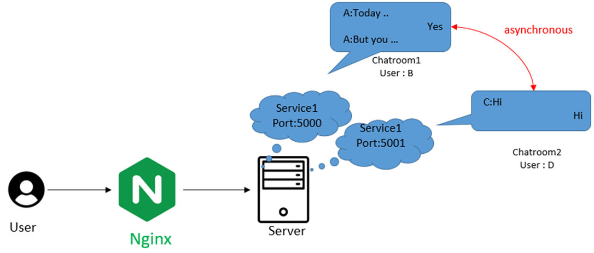
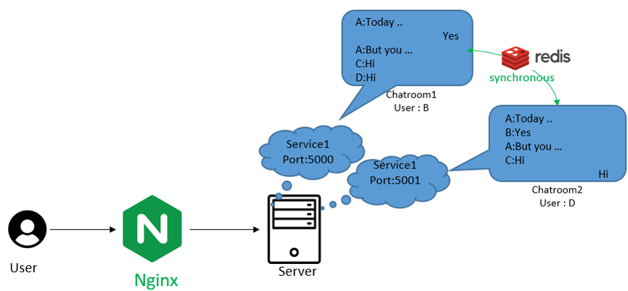
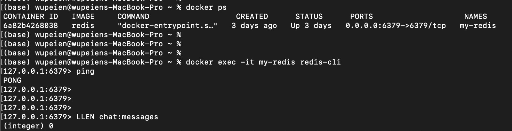
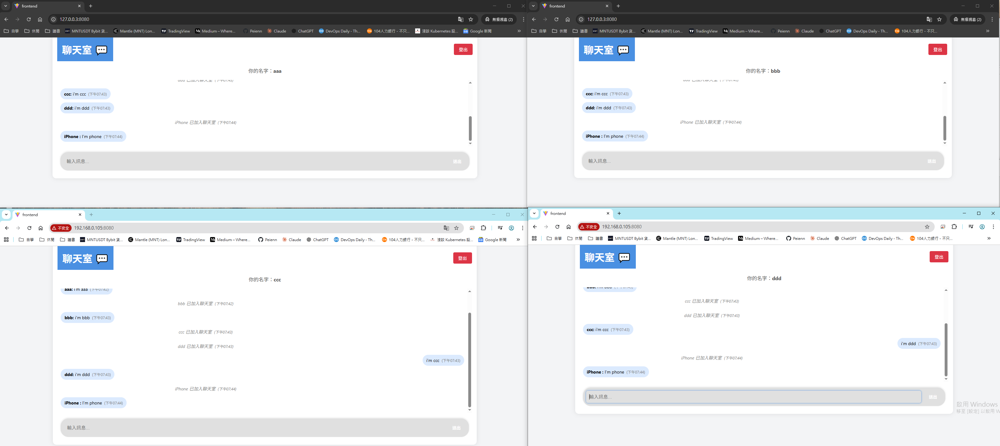
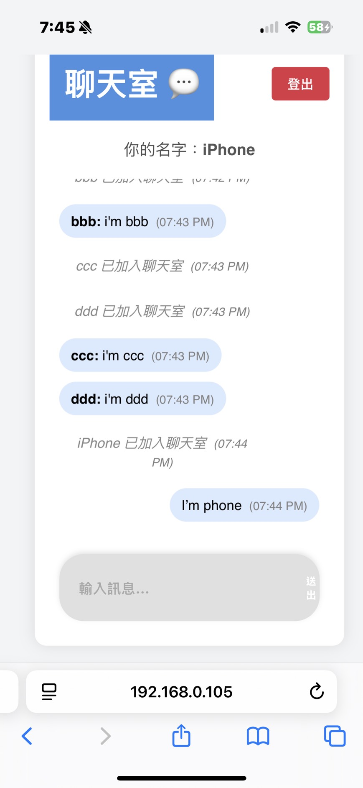
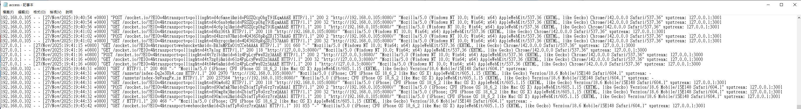
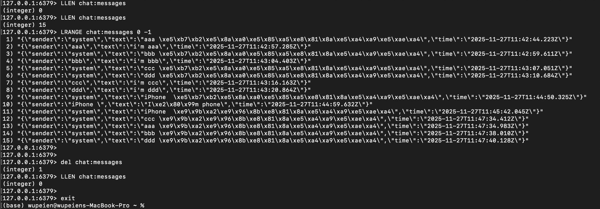

上一篇文章提到，在多人聊天室架構中加入 Nginx，雖然能實現反向代理及流量控制，  
但也導致使用者被隨機分配到不同的聊天室實例，無法保證在同一間聊天室中互動。



這個問題可以透過 Redis 的 **Pub/Sub** 功能來解決


# 主要流程
1. Redis 介紹
2. Redis 安裝
3. Redis 實作


## Redis 介紹

Redis 是一種 **NoSQL 資料庫（鍵值 key-value store）**。資料主要存放於 **記憶體 (RAM)** 中，讀寫速度極快，因此以高速的記憶體存取為特色。  

## 核心特性
- **多種資料類型**：除了基本的字串 (String)，還支援清單(List)、集合(Set)、雜湊(Hash)、有序集合(Sorted Set) 等，方便處理各種不同需求。
- **原子操作**：Redis 的指令操作一次完成，不會被其他操作打斷，確保資料一致性。
- **容易擴展**：支援主從複製、資料分片（Sharding），還有集群(Cluster)架構，可以隨系統需求增加機器，提升效能與可用性。
- **輕量部署**：單一執行檔，安裝快速，資源消耗低。


### 持久化機制 

Redis 既然是存放在記憶體內，如何持久化（資料永久保存）以確保資料在斷電或重啟後可恢復 ?

1. **RDB (Snapshotting)**   （預設啟用）
   - 以指定的時間間隔，將記憶體裡的資料快照存成二進位檔 `.rdb`。重啟時會載入這些快照還原資料。  
   - 優點：備份檔案小，恢復速度快，但資料更新非即時。*

2. **AOF (Append Only File)**  （預設關閉）
   - 將每筆寫入命令依序追加至日誌檔案，重啟時依序執行命令進行資料還原。  
   - 優點：資料持久化更即時，可減少資料遺失風險，但檔案較大且恢復速度較慢。*

3. **兩者可同時啟用**，兼顧資料安全與恢復效率。


| 項目           | RDB （預設啟用）               | AOF （預設關閉）                 |
|----------------|-------------------------------|---------------------------------|
| 資料寫入方式    | 定期產生快照檔案               | 紀錄每筆寫操作命令並同步寫入     |
| 對系統效能影響  | 較小，寫磁碟頻率較低           | 較大，頻繁磁碟 I/O              |
| 資料恢復速度    | 較快，讀取快照檔重建資料       | 較慢，需重播操作日誌            |
| 持久化資料完整性| 可能丟失最近一段時間資料       | 幾乎不會遺失資料                |
| 設定複雜度      | 簡單，較適合初學者             | 較複雜，需注意 AOF 文件管理     |
| 適合使用情境    | 追求較高效率、可接受少量極端資料損失 | 需要高資料可靠性與完整性應用     |

### Redis 常見應用場景
- **快取 (Caching)**  
  快速緩存熱門資料，減輕後端資料庫壓力，提升系統效能。

- **會話管理 (Session Management)**  
  集中管理使用者登入狀態與資訊，支援多台伺服器共享 session。

- **排行榜 (Leaderboards)**  
  利用 **Sorted Set** 快速計算和更新排名。

- **訊息佇列與發布/訂閱 (Message Queue & Pub/Sub)**  
  實現即時通知與跨服務訊息傳遞。

- **即時數據分析**  
  支援高頻率讀寫的即時統計與監控系統。

---


## Redis 安裝
下面以常見的作業系統為例，說明如何安裝 Redis。<br>
(Redis 官方沒有正式 Windows 版本)


### 1. 在 Ubuntu / Debian Linux 安裝

```markdown
# 更新套件清單
sudo apt update 

# 安裝 Redis 伺服器
sudo apt install redis-server

# 啟動 Redis 服務
sudo systemctl start redis

# 設定開機自動啟動
sudo systemctl enable redis

# 檢查 Redis 是否正常運作。若回傳 PONG 表示運作正常
redis-cli ping
```
### 2. 用 Docker 安裝
```markdown
# 下載並啟動 Redis
docker run -d --name my-redis -p 6379:6379 redis:latest

# 確認 Redis
docker ps

# 測試 Redis 是否正常
docker exec -it my-redis redis-cli

$ ping 
>> pong
```
---

### 3. 檢查持久化設定

```bash
$ CONFIG GET SAVE
>> 1) "save"
>> 2) "900 1 300 10 60 10000" 
表示啟用 RDB 快照備份。

$ CONFIG GET appendonly (Default: no )
>> 1) "appendonly"
>> 2) "no"

```


## Redis 實作

搭配上一篇的多人聊天室，這次要將兩個後端伺服器產生的聊天室`同步訊息`。

### 架構調整
在原本聊天室內容各自一方的情況下，增加redis來同步聊天室的內容。

- 網頁伺服器 * 1 (Web Server)
- 後端伺服器 * 1
- 服務 * 1 (Port:5000) +  服務 * 1 (Port:5001)
- <span style="color:green">NoSQL DB (redis) </span>
  


---

### 程式及參數調整

#### steps 1:修改後端，內容較多 (前端不用改)

- 先安裝套件: npm install redis
- 載入套件和設定連線資訊

```bash
# 載入redis
const { createClient } = require('redis');
# 一般操作（例如讀寫資料、發佈訊息等）
const redis = createClient({ socket: { host: "192.168.0.101", port: 6379 } });
# 專用於訂閱（subscribe）頻道接收訊息
const redisSub = createClient({ socket: { host: "192.168.0.101", port: 6379 } });

# Redis 連線或操作發生錯誤時會報錯
redis.on("error", (err) => console.log("Redis Error:", err));
redisSub.on("error", (err) => console.log("RedisSub Error:", err));
```
---
- 建立連線並且訂閱頻道 "chat-message"

```bash
(async () => {
  # 連線兩個Redis Instance
  # redis.connect是非同步操作，等到連線成功才往下執行，所以用await等待
  await redis.connect(); 
  await redisSub.connect();
  console.log("Redis connected!", await redis.ping());
  # 訂閱chat-channel頻道
  await redisSub.subscribe("chat-channel", (messageJson) => {
    const msg = JSON.parse(messageJson); # 把收到的訊息轉成 JavaScript 物件
    io.emit("chat-message", msg);        # 同步給這台 server 的所有使用者
  });
})();
```
---
- Before : 所有行為產生的Msg，放到用於紀錄訊息的messages後，再io.emit()廣播給聊天室
- After :  所有行為產生的Msg，放到Redis List後廣播


```bash
# 程式碼改完後發現有很多相似處，所以才寫成一個function
async function pushMessageToRedis(message) {
  const json = JSON.stringify(message);
  # 訊息加入 Redis List（聊天歷史）
  await redis.rPush("chat:messages", json); 
  # 每次都把頻道的訊息刪除到只剩下50則，避免訊息無限增長
  await redis.lTrim("chat:messages", -50, -1);
  # 發佈訊息到頻道，讓訂閱該頻道的都可以收到
  await redis.publish("chat-channel", json);
}

# Before : 
#    const joinMsg = { sender: 'system', text: `${name} 已加入聊天室` };
#    messages.push(message);
#    io.emit('chat-message', joinMsg);


# After : 執行 pushMessageToRedis
const joinMsg = { sender: 'system', text: `${name} 已加入聊天室` };
await pushMessageToRedis(message);

```


#### steps 2: 檢查結果

因為已經用Docker裝好了，所以直接啟用redis Server，並透過指令檢查是否正常可用 



---

測試方法與上次加入Nginx時一樣

- 圖的上方兩個是輸入 127.0.0.1:8080  --> (loopback 介面 (lo0) ,虛擬網卡)
- 圖的下方兩個是輸入 192.168.0.103:8080 --> (實體網卡 (WiFi/Ethernet))

但上次的結果是`IP Hash`導致被引導至`不同的聊天室` (有兩個後端伺服器，且資訊不共享)

而這次可以發現上下兩邊的資訊都是一致的(包含手機連線)。

並不是被導入到相同聊天室，而是因為`兩邊的資訊透過Redis的Pub/Sub共享了`。





下圖 Nginx/access.log中看出，不同的IP被導到不同的後端(Port:3000 & Port:3001)

- 192.168.0.105 - - [27/Nov/2025   .....    upstream: 127.0.0.1:3001
- 127.0.0.1 - - [27/Nov/2025      .....    upstream: 127.0.0.1:3000
- 192.168.0.102 - - [27/Nov/2025   .....    upstream: 127.0.0.1:3001
  



---

最後，可以回到redis Server中，檢查訂閱的頻道 "chat:messages" 其內容是否與前後端顯示的一致

- 開始前檢查長度:0
- 結束後檢查長度:15
- 檢查所有訊息可以看到確實就是剛剛的使用者 (aaa, bbb, ... , iPhone)
- 最後刪除頻道的內容並離開
  



# 結論和延伸

## 結論

Nginx幫助我們的聊天室做到 `簡易分散式架構` ，以及`基本流量分流`，但是因為`缺少記憶體共享`導致不同後端的聊天室被分開。

這次透過Redis (NoSQL) 將所有訊息存在Redis List中，以Pub/Sub的方式將訊息共享給多個後端，實現`分散式環境下的記憶體共享`，解決前述問題。

## 延伸問題

進入聊天室後，如果重新整理網頁(F5) 就會直接離開聊天室，並要求重新輸入名稱才能進入。

這是因為欠缺一個機制 : **`缺少使用者身分認證機制`** 。

**解決方法:**

  1. ✅ **Cookie Session + Redis Session Store（最推薦）**  
     - `session_id` 存在瀏覽器的 Cookie 裡  
     - Session 資料存到 Redis → 多後端共用 
     - 可控管登入 / 踢人  
     - 配合 Redis 可支援多後端  

  2. ❌ **JWT（不推薦聊天室用）**  
     - Token 無法輕易被伺服器強制失效  
     - 不利於管理使用者連線狀態 
     - 增加安全與同步負擔
     - 適合 App 或 REST API


下一篇討論 Session 機制，並利用Cookie Session + Redis Session Store 解決身分認證機制問題。
