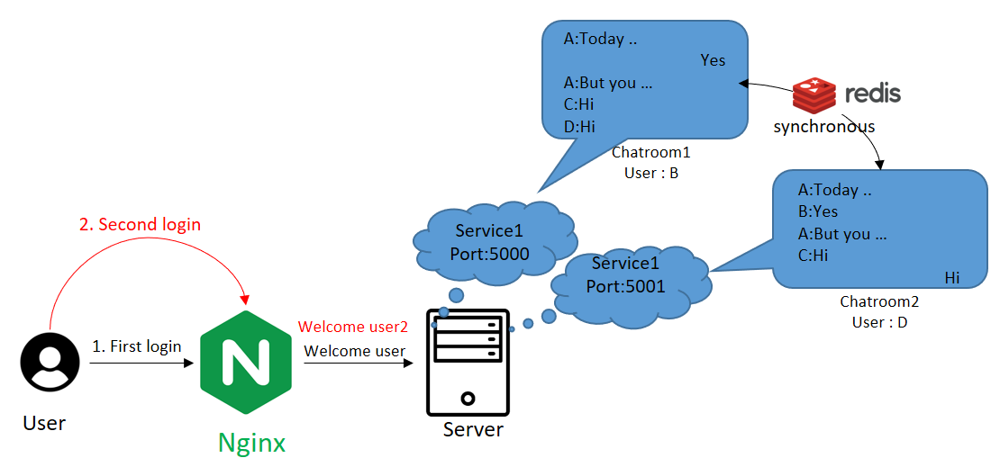
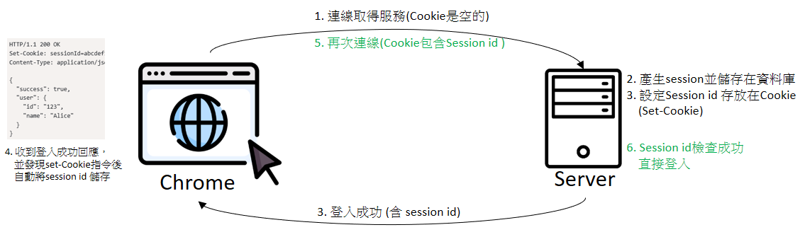
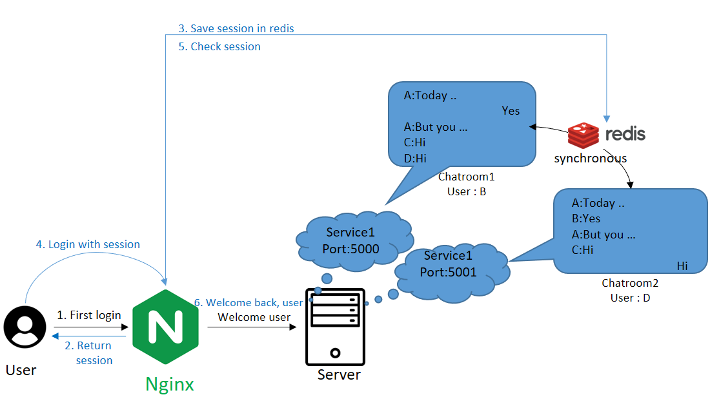
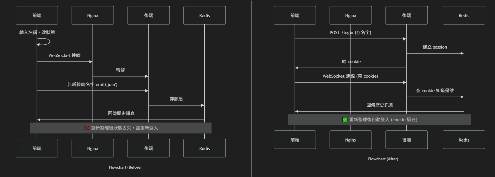
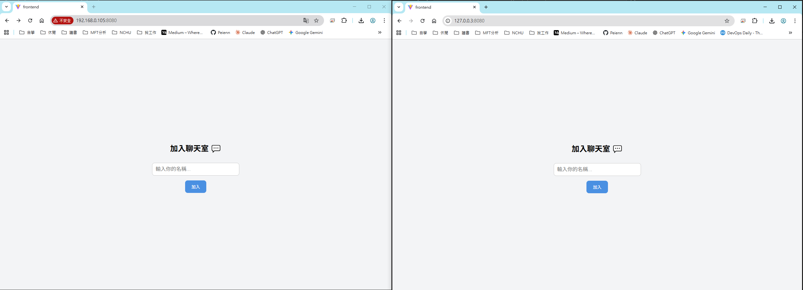
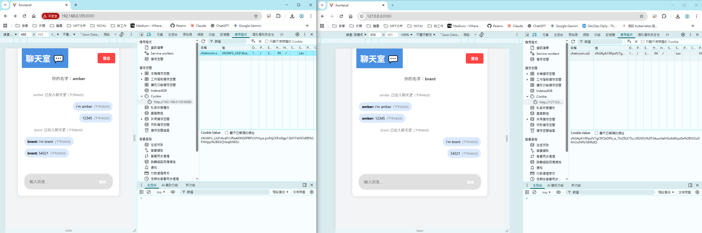
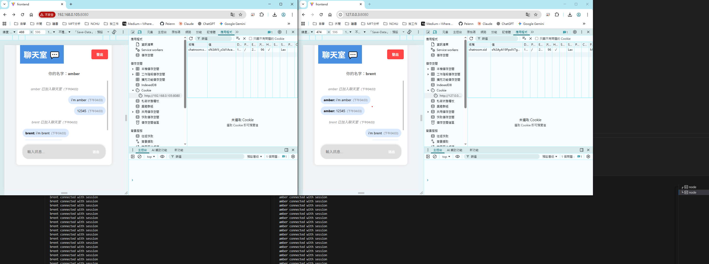
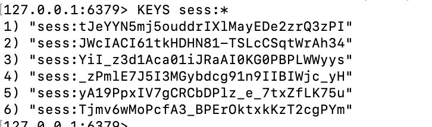

上一篇提到缺少`會話管理機制`，導致使用者每次進入聊天室時，都必須重新輸入名稱，無法記住之前的狀態。

這是因為系統沒有儲存使用者的會話資訊，無法識別「這個使用者之前訪問過」。

為了解決上述問題，這次將加入 **Session** 。

<br>
<br>



# 主要流程

1. Session 與 Cookie 介紹
2. Session 實作

## 1. Session 與 Cookie 介紹


- Session 是常見的伺服器端會話管理機制，用來記錄並維護使用者登入狀態。當使用者輸入正確的帳號/密碼後，伺服器會產生一組唯一的 Session，並將其資料儲存於資料庫或快取系統（如 Redis）中。

    - Session 內有一組唯一識別碼 : Session ID
    - Session 可以設定時效性
    - 管理方便，可以直接至資料庫刪除Session


-  Cookie 是瀏覽器用來儲存少量資料的機制，可以想像成`瀏覽器自帶的一個小型文字檔`。<br>當`開發者希望瀏覽器在之後的請求中帶上某些認證或辨識資訊`時，會在後端的 HTTP 回應中加入 Set-Cookie 標頭，告訴瀏覽器要建立或更新 Cookie。<br>`瀏覽器收到這個HTTP 回應後，會將資訊儲存在 Cookie 中`，並在未來對同一個網站的請求，自動夾帶這些 Cookie，協助後端辨識使用者身分或狀態。

    - 主要用於維持會話狀態、存放識別碼、個人化偏好設定
    - 每次請求都會攜帶，應避免放太大或敏感資料。





---


## 2. Session 實作

### 流程說明

1. 使用者(Amber)連線至聊天室
2. 前端接收完傳給後端，認證成功後產生一組session，並儲存到Redis
3. 後端將Session id 傳給前端，並讓瀏覽器儲存至cookie，並建立前後端的WebSocket連線
4. 使用者(Amber)離開後再次連線至聊天室，瀏覽器中Cookie有Session id
5. 後端接收到Session id 至Redis檢查，如果有就直接進入聊天室
6. 如果沒有，就顯示最初登入畫面





今天看到有種基於文字的圖表繪製工具 : Mermaid ，於是用Mermaid做了一個流程圖的差異。

但嘗試了多種方法都無法在Github Page上顯示 (vscode 可以)，所以暫時放棄用圖片。



```bash
sequenceDiagram
    participant 前端
    participant Nginx
    participant 後端
    participant Redis
    
    前端->>前端: 輸入名稱，改狀態
    前端->>Nginx: WebSocket 連線
    Nginx->>後端: 轉發
    前端->>後端: 告訴後端名字 emit('join')
    後端->>Redis: 存訊息
    Redis->>前端: 回傳歷史訊息
    
    Note over 前端,Redis: ❌ 重新整理後狀態丟失，需重新登入

sequenceDiagram
    participant 前端
    participant Nginx
    participant 後端
    participant Redis
    
    前端->>後端: POST /login (存名字)
    後端->>Redis: 建立 session
    後端->>前端: 給 cookie
    前端->>後端: WebSocket 連線 (帶 cookie)
    後端->>Redis: 查 cookie 知道是誰
    Redis->>前端: 回傳歷史訊息
    
    Note over 前端,Redis: ✅ 重新整理後自動登入 (cookie 還在)
```


### 安裝套件介紹

- express-session : Node.js用於建立和管理Session（例如建立 Session、更新內容、過期時間管理、刪除 Session 等）。但它本身不直接知道如何把 Session 資料「存到具體的地方」。它只定義一套操作 Session 的抽象介面（Session Store interface）。

- connect-redis : 專門為express session設計的 橋樑」或「轉譯器」。實作 express-session 的 Session Store 介面。告訴 express-session 怎麼用 Redis 命令來存、讀、更新和刪除 Session，讓 Redis 能「配合」express-session 管理 Session。


### 前後端程式講解

這次調整的內容很多，應該是因為之前寫得太簡單，這次加入Session後有很多要更改，所以這次用流程搭配程式碼來解說。


#### 📝 登入
當你在前端輸入完名稱後按下加入按鈕，會先在前端驗證有無姓名，沒有的話直接結束，有名稱的話，呼叫/login 並帶入cookie內資訊，後端的 /login會再次驗證姓名是否輸入，才會去幫你在Redis建立Session，將"姓名"已加入聊天室存在Redis的歷史訊息，最後回傳給前端success跟session_id。前端收到success後就會把joined改成true, 這樣才會return ChatRoom (把你帶到聊天室畫面)。


#### 💬 進入聊天室與 WebSocket 連線
當進入聊天室後(ChatRoom.tsx)，會執行一次Socket連線 `useEffect(() => {// 建立 Socket 連線（帶 credentials）socketRef.current = io({ ...}, []); `，裡面包含了用io建立Socket連線並攜帶cookie，以及定義了當後端emit了各種訊息，前端該怎麼對應處理。例如後端emit("history")，前端就會直接把messages改成後端傳來的msgs。這些都用socket.on去時刻的監聽著。

在後端方面，當 WebSocket 連線建立時，後端的 `io.on('connection', ...)`會被觸發。後端會從 cookie 中讀取 session（透過 socket.request.session），檢查是否已登入。如果沒有 session 或沒有 username，就會 `emit("auth-required")` 並 `disconnect(true)` 拒絕連線。如果有 session，後端就直接從 session 知道使用者名稱，然後從 Redis 讀取歷史訊息，透過 `emit("history", messages)` 傳送給前端。


#### ✉️ 發送訊息流程
當你輸入完訊息並按下送出後，會驅動 `const handleSend()`，handleSend()會帶著訊息 `emit("chat-message")`，後端的`socket.on('chat-message', async (text) `接收到後先判斷session是不是正常的，如果不是就emit("auth-required)，前端收到後就會跳出alert("登入過期，重新登入")，重新reload畫面。如果正常的話就將剛剛收到的訊息與時間和session中的username合併，儲存到redis並且廣播給其他訂閱相同頻道的後端(因為有多後端)。結束後前端的handleSend()會將輸入文字區域input改成""。這樣就完成了輸入文字以及將訊息儲存到Redis的過程。

#### 🔄 重新整理頁面（檢查 Session）
另外每次頁面載入時都會執行App.tsx的`checkSession()`，`checkSession()`會帶著你的cookie `credentials: "include"` 去呼叫後端的API /check-session。檢查你攜帶的cookie中session id 是不是存在Redis中，如果是的話會return `loggedIn=true` 和`Name = session id's name`，再把joine改成true, name改成session id's name，這樣就可以直接進入聊天室而不需要回到登入畫面。

多了一個loading變數是因為如果/check-session 還未完成，怕使用者看到登入畫面後才切回聊天室。如果是看到"載入中"然後才切回聊天室會比較符合邏輯。


#### 👋 登出流程
要離開時，會在ChatRoom按下離開Button，觸發handleLogout，先詢問是否要登出，如果是的話`emit("user-logout")`讓會後端將"使用者"離開聊天室寫入Redis並廣播，再把socket disconnect(斷開連線)，再去呼叫後端API /logout， /logout會清除redis的Session `(req.session.destroy)`，以及清除前端的Cookie  `res.clearCookie('chatroom.sid');`。然後呼叫 `onLogout` (App.tsx中的handleLogout)，把joined改回false,Name改回空字串。因為joined是false所以會回到登入畫面。


### Nginx調整

因為後端加入了API 做Session驗證，所以Nginx也要增加一些路由，其中也可以看到Nginx轉送Cookie
```bash
location ~ ^/(login|logout|check-session) {
    proxy_pass http://api_upstream;
    
    proxy_set_header Host $host;
    proxy_set_header X-Real-IP $remote_addr;
    proxy_set_header X-Forwarded-For $proxy_add_x_forwarded_for;
    
    proxy_set_header Cookie $http_cookie;
    # - `proxy_set_header`：設定要傳給後端的 header
    # - `Cookie`：header 名稱
    # - `$http_cookie`：Nginx 變數，表示前端送來的 Cookie header

    # **實際效果：**
    # ```
    # 前端送出：
    # GET /check-session HTTP/1.1
    # Cookie: chatroom.sid=abc123

    # Nginx 轉發給後端：
    # GET /check-session HTTP/1.1
    # Cookie: chatroom.sid=abc123  ← 這行被加上去
    # ```

    # **如果沒有這行：**
    # ```
    # 前端送出：
    # Cookie: chatroom.sid=abc123

    # Nginx 轉發給後端：
    # (沒有 Cookie header)  ← 後端收不到 cookie

    # 後端：
    # req.session.username = undefined  ← 查不到 session
    proxy_pass_header Set-Cookie;
    # **說明：**
    # - `proxy_pass_header`：允許某個 header 通過 Nginx
    # - `Set-Cookie`：後端設定 cookie 的 header

    # **實際效果：**
    # ```
    # 後端回傳：
    # HTTP/1.1 200 OK
    # Set-Cookie: chatroom.sid=abc123; Path=/; HttpOnly

    # Nginx 轉發給前端：
    # HTTP/1.1 200 OK
    # Set-Cookie: chatroom.sid=abc123; Path=/; HttpOnly  ← 這行被保留
    # ```

    # **如果沒有這行：**
    # ```
    # 後端回傳：
    # Set-Cookie: chatroom.sid=abc123

    # Nginx 預設會過濾某些 header，包括 Set-Cookie

    # 前端收到：
    # (沒有 Set-Cookie header)  ← 前端無法儲存 cookie}
    }
```

---

### 實際結果

這次用兩個畫面而不是四個畫面，因為來源端會有Cookie紀錄。

- 127.0.0.1:8080  --> (loopback 介面 (lo0) ,虛擬網卡)
- 192.168.0.103:8080 --> (實體網卡 (WiFi/Ethernet))

1. 首先進入聊天室，要求輸入名稱



2. 進去聊天室後，可以按下F12 --> 應用程式 --> Cookie檢查



3. 即便我一直按下F5，後端也一直在Console.log()，但聊天室仍然不會被登出



4. 從Redis裡面可以找出目前有哪些Session紀錄在內，從上面的網站中找出session id
      - s%3AyA19PpxIV7gCRCbDPlz_e_7txZfLK75u.UlGX0U%2F3AuoJtaHGwkANyz0e%2BW2s2IhH2wNFbTdXRdQ
      - s%3AYiI_z3d1Aca01iJRaAI0KG0PBPLWWyys.poNijCKFsi8gp13bFI7aMOsBB%2FNHpp%2B83QVeqEt9KlU

    透過URL解碼 (decodeURlComponent)

     - s:yA19PpxIV7gCRCbDPlz_e_7txZfLK75u.UlGX0U/3AuoJtaHGwkANyz0e+W2s2IhH2wNFbTdXRdQ
     - s:YiI_z3d1Aca01iJRaAI0KG0PBPLWWyys.poNijCKFsi8gp13bFI7aMOsBB/NHpp+83QVeqEt9KlU

    取出中間部分 sessionID  `s:<sessionID>.<簽章/哈希>`   (`s:` 前綴 ;`.<簽章/哈希>` 驗證 cookie 是否被竄改)
     - yA19PpxIV7gCRCbDPlz_e_7txZfLK75u
     - YiI_z3d1Aca01iJRaAI0KG0PBPLWWyys

    可以發現這兩組SessionID 確實都存在redis中。 (3) and (5)



# 結論和延伸

## 結論

這次加入Session 可以幫助我們將聊天室從「無狀態」升級為「有狀態」。只有當Session 在Redis裡面失效才會要求使用者重新登入。

但管理者可以隨時進入Redis 刪除 Session。


## 延伸問題 : 為什麼還需要關聯性資料庫？

目前只使用 Redis 儲存資料，雖然可以透過 **RDB + AOF** 做到資料持久化，但仍有以下問題：

#### 1. 記憶體限制
Redis 是**記憶體資料庫**，當聊天訊息不斷增長達到記憶體上限時：
- Redis 可能會拒絕新的寫入
- 或根據策略自動刪除舊資料

#### 2. 查詢能力不足
Redis 採用 **key-value** 儲存結構，不擅長：
- 複雜查詢（例如：查詢某使用者的所有訊息）
- 資料分析（例如：統計每日活躍使用者數）
  
#### 3. 資料管理困難
- 缺乏使用者管理功能（註冊、個人資料等）
- 無法記錄登入日誌和系統審計 (Audit)


### 解決方案：Redis + PostgreSQL

下一篇將討論如何加入 PostgreSQL 資料庫，實現以下架構：
```
📊 資料分層策略
├─ 快速載入（Redis）
│  └─ 最新 50 條訊息
│  └─ Session 資料
│
└─ 永久保存（PostgreSQL）
   └─ 完整聊天記錄
   └─ 使用者資料
   └─ 登入日誌
```

**查詢流程：**
1. **載入最近訊息** → 從 Redis 快速讀取
2. **查詢歷史記錄** → 從 PostgreSQL 撈取
3. **發送新訊息** → 同時寫入 Redis 和 PostgreSQL

