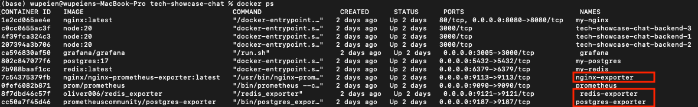
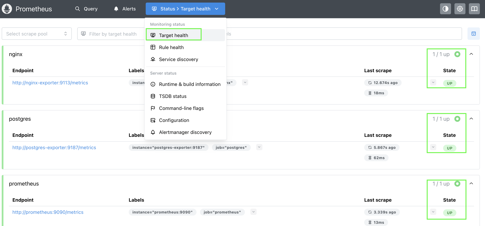
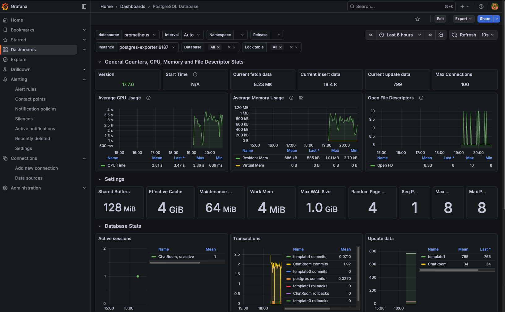

# 主要流程 

1. Prometheus 介紹
2. Grafana 介紹
3. Prometheus 與 Grafana 的整合優勢
4. Prometheus + Grafana 實作
   
## Prometheus 介紹

Prometheus 是一個「 開源 」的 <u>系統監控和告警工具 </u>。專門設計用於收集和儲存時間序列數據，透過主動拉取 (Pull) 的方式從目標收集時間序列指標，主要用於監控和告警。

### 工作原理：
1. 在目標裝置安裝 Exporter
2. Exporter 收集目標裝置的時間序列指標
3. Prometheus Server 定期拉取 Exporter 的資料並儲存到時間序列資料庫

### 核心特性
- **多維度資料模型**：透過 Metric 名稱和 Key/Value 標籤（Labels）來區分不同的時間序列。
- **靈活的查詢語言**: 提供 PromQL (Prometheus Query Language) 進行複雜的資料查詢、聚合和分析
- **Pull 模式**: 主動從目標拉取指數據,而非被動接收
- **時間序列儲存**: 高效的時間序列資料庫
- **告警機制**: 透過 Alertmanager 進行靈活的告警配置和通知


### 適合場景

- 容器化環境：自動發現服務實例（Service Discovery），適合動態環境。例如：k8s
- 應用程式效能監控(APM)：監控 Web API、資料庫查詢時間、HTTP 請求成功率
- 基礎設施監控 ：透過 Exporter 抓取設備的CPU、記憶體、磁碟、網路流量等資源使用情況

## Grafana 介紹

Grafana 是一個「 開源 」的 <u>資料視覺化和監控平台</u>, 能夠將來自多種資料來源的指標轉換為精美的圖表和儀表板，且提供了強大的查詢編輯器和豐富的視覺化選項。

### 核心特性

- **支援多種資料來源**: 支援 Prometheus、InfluxDB、Elasticsearch、MySQL 等數十種來源
- **豐富的視覺化選項**: 提供圖表、儀表盤、熱圖、表格等多種展示方式
- **動態儀表板**: 支援變數、模板和動態查詢
- **告警功能**: 內建告警引擎,可設定條件式告警
- **權限管理**: 提供組織、團隊和用戶的權限控制


### 主要功能模組

1. **Dashboard**: 儀表板,包含多個 Panel 的視覺化頁面
2. **Data Source**: 資料來源
3. **Alerting**: 告警規則和通知管理
4. **Variables**: 變數系統,實現動態儀表板

##  Prometheus 與 Grafana 的整合優勢

- 皆為開源
- 皆支援 PromQL 查詢語言
- 可即時預覽查詢結果
- 豐富的社群儀表板模板
- 可視覺化 Prometheus 告警狀態

##  Prometheus + Grafana 實作


實現方法：

1. 透過 Prometheus 搜集目標裝置的資訊
2. 資訊交由 Grafana
3. Grafana 根據這些資訊，呈現各種不同的圖表
   

實際操作：

這次我們針對 Nginx, Redis, PostgreSQL 進行監控。
因此步驟如下


### Steps 1 : Docker 安裝 Prometheus 和 Grafana

建立方法就直接放到 docker-compose.yml裡面 ，很簡單。

另外，需要配置一個 prometheus.yml檔給 Promethues 使用。這個yml檔就是紀錄 Prometheus要去哪些目標搜集資訊．

```bash
global:
  scrape_interval: 15s

scrape_configs:
  - job_name: "prometheus"
    static_configs:
      - targets: ["prometheus:9090"]

  - job_name: "redis"
    static_configs:
      - targets: ["redis-exporter:9121"]

  - job_name: "postgr es"
    static_configs:
      - targets: ["postgres-exporter:9187"]

  - job_name: "nginx"
    static_configs:
      - targets: ["nginx-exporter:9113"]

```

### Steps 2 : Docker 安裝Exporter 進行資訊搜集

因為已經都改用 Docker ，這邊的 Exporter 也用 Container 來建造。（如果是VM可以直接下載Exporter並安裝在指定的主機）

設定值都更新在 docker-compose.yml裡面，

其中因為 Nginx 本身沒辦法回傳這些監控值，因此需要在 Nginx.conf 裡面修改：

```bash
# 修改1 : 如果繼續使用 ip_hash, 因為所有 Client端都是先連線到Container後轉到Nginx，
#         因此Source IP 永遠都會是 Container的 IP ，所以這邊改用cookie做hash確保每一次都分到同一個後端
upstream api_upstream {
        hash $cookie_chatroom.sid consistent;
        server backend:3000;

    }

# 修改2 : 增加 Nginx  stub_status 套件，提供Exporter獲取系統資訊
location /nginx_status {
            stub_status;
            allow 0.0.0.0/0;
            # deny all;

        }
```



### Steps 3 ：Grafana 獲取資訊

接下來就到Grafana的網站中， 設定 data Source是 Prometheus 並且給予 Dashborad 就可以了．
Dashborad 可以直接上網查，不需要自己重頭開始建。如何設定網路上到處都是教學而且很簡單．


### 實際結果




