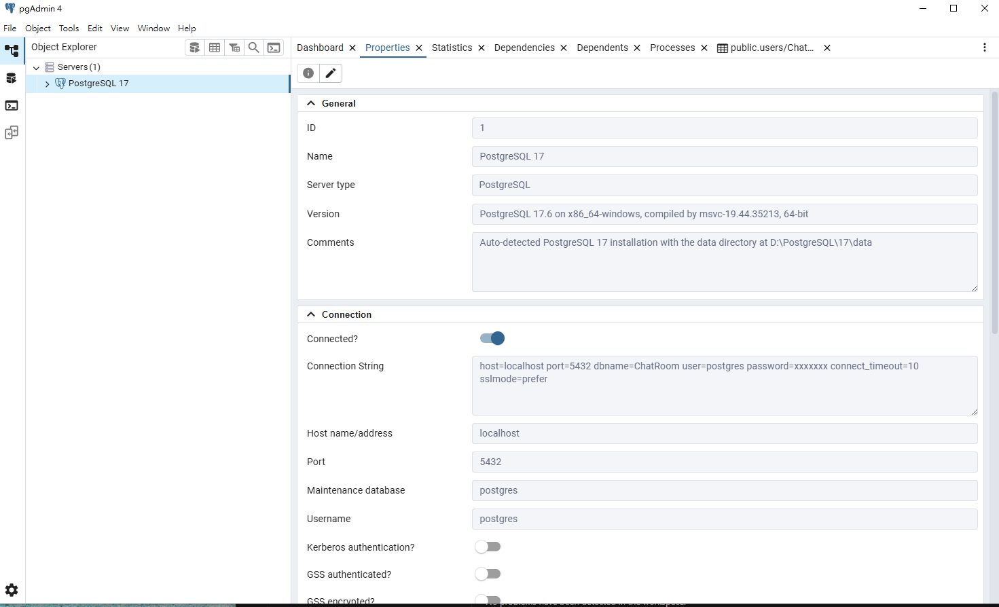

# 主要流程

1. PostgreSQL 介紹
2. PostgreSQL 安裝
    - 安裝方式
    - 資料庫備份
    - 異常偵測
3. PostgreSQL 實作 (搭配聊天室)


## 1. PostgreSQL 介紹

介紹PostgreSQL之前，先討論市占率最高的 關聯式資料庫管理系統 (RDBMS) :

 - 開源 (Open) : MySQL, PostgreSQL
 - 商用 (Business) : Oracle, Microsoft SQL Server 

因為是個人專案所以從`開源`中選擇，而挑選 `PostgreSQL原因 :

-  **功能比較強大**  
   PostgreSQL 支援更多元的功能和資料類型，能處理更複雜的資料和需求。

-  **穩定可靠，資料安全**  
   它對資料一致性和安全性要求很高，適合重要資料的存放。

-  **有一定領域知識**  
   目前工作內容中一部分是負責公司 OracleDB 的維運管理

| 項目       | PostgreSQL               | MySQL                     |
|------------|-------------------------|---------------------------|
| 功能       | 多功能、支援進階資料類型    | 功能基本，較適合簡單應用       |
| 資料安全   | 嚴格符合 ACID 標準         | 部分儲存引擎支援 ACID        |
| 效能       | 高頻寫入效能               | 高頻讀取效能                 |
| 索引類型   | 支援多種索引               | 支援基本索引                 |
| 上手難易度 | 較複雜                   | 較容易                      |


由此可知，PostgreSQL 是一個兼具穩定性、彈性與專業級能力的資料庫系統。


## 2. PostgreSQL 安裝


安裝完資料庫，緊接著就是需要針對資料庫進行備份和監控。

### 安裝方式

#### 1. Windows

```bash
其實就是去官網下載，然後執行這樣。
Port : 5432 (Default)
輸入的密碼要記得。 (但忘記也可以找回)
```



#### 2. Ubuntu Linux 

```bash
# 更新套件
sudo apt update
sudo apt upgrade -y

# 安裝
sudo apt install postgresql postgresql-contrib -y

#  啟動與查看
sudo systemctl start postgresql
sudo systemctl enable postgresql
sudo systemctl status postgresql
```

### 資料庫備份

**備份重要、很重要、非常重要**。因為不論是 <u>被駭客入侵</u> 或是 <u>操作錯誤</u> 都可以透過完整備份檔將資料恢復。

備份方法有二種 : 邏輯備份和物理備份

- 邏輯備份（Logical Backup）  
  - 匯出 SQL 指令或自訂格式備份。  
  - 適用單一資料庫、小型或中型專案。  
  - 工具：`pg_dump`（單一資料庫備份）、`pg_dumpall`（全部資料庫及使用者備份）。

  ```bash
  # 備份單一資料庫
  pg_dump -U postgres your_database > backup.sql

  # 備份全部資料庫及使用者設定 (不用指定database)
  pg_dumpall -U postgres > all_backup.sql
  ```


- 物理備份（Physical Backup） 
  - 複製整個資料目錄和 WAL 日誌。  
  - 適用大型資料庫、需快速還原環境。  
  - 工具：`pg_basebackup` 搭配 WAL 持續備份。
  ```bash　
  # postgresql.conf 設定範例（需重啟生效）
  wal_level = replica                   # 啟用複寫及進階備份功能
  archive_mode = on                     # 開啟 WAL 歸檔功能
  archive_command = 'cp %p /wal_archive/%f'  # 備份 WAL 檔案到指定目錄

  # 每周 pg_basebackup
  pg_basebackup -h localhost -D /path/to/backup -U replicator -Fp -Xs -P
  
  # replicator 角色需要有 replication 權限
  # 定期清除 WAL 檔案
  ```


### 異常偵測 : pgAudit

這邊主要是針對資料庫的<u>操作異常</u>、<u>影響資料庫安全問題的行為</u> 進行偵測。


- **pgAudit** 是 PostgreSQL 官方推薦的審計套件，可以詳細記錄資料庫內的 DDL、DML 操作以及角色權限變動。

   1. 安裝 pgAudit
   
   2. 修改 postgresql.conf ： 加入 `shared_preload_libraries = 'pgaudit'`，
   
   3. 重新啟動 PostgreSQL。

   4. 開啟audit 功能 `ALTER SYSTEM SET pgaudit.log = 'role, ddl';`

      #### `role` 類別 : 與角色（Roles）及權限相關的所有操作，包括：
      - 建立角色（`CREATE ROLE`、`CREATE USER`）  
      - 刪除角色（`DROP ROLE`、`DROP USER`）  
      - 權限指派（`GRANT`）與收回（`REVOKE`）  
      - 修改角色屬性（如密碼、登入權限變更）  

      #### `ddl` 類別 : 資料定義語言（DDL）類操作，包含對資料庫結構的更動，如：
      - 建立／刪除／修改資料表（`CREATE TABLE`, `DROP TABLE`, `ALTER TABLE`）
      - 建立／刪除／修改索引（`CREATE INDEX`, `DROP INDEX`）  
      - 建立／刪除／修改視圖、序列、函式等物件  

   5.  `SELECT pg_reload_conf();`  //重新載入設定檔


## 3. PostgreSQL 實作 (搭配聊天室)

上一篇 Session 文章中，我們討論的延伸問題是因為目前Redis 是記憶體型資料庫，無法支撐大量訊息作為儲存，以及Key-Value的儲存結構下，無法支撐複雜查詢和資料分析。
也沒有完整的管理功能來保護使用者。因此需要一個 RDBMS 作為後端的主要資料庫。

加入PostgreSQL後要達成的目標 : 

```
📊 資料分層策略
├─ 快速載入（Redis）
│  └─ 最新 50 條訊息
│  └─ Session 資料
│
└─ 永久保存（PostgreSQL）
   └─ 完整聊天記錄
   └─ 使用者資料
   └─ 登入日誌
```
**查詢流程：**
1. **載入最近訊息** → 從 Redis 快速讀取
2. **查詢歷史記錄** → 從 PostgreSQL 撈取
3. **發送新訊息** → 同時寫入 Redis 和 PostgreSQL


### 程式碼和參數調整


#### 後端


1. 每次訊息寫入Redis時，也要抄寫一份到PostgreSQL
2. 建立獲取PostgreSQL 訊息的API， 讓前端可以在 "觸發條件" 觸發時獲取歷史訊息。


#### 前端

1. 登入時到PostgreSQL 檢查使用者是否存在
2. 